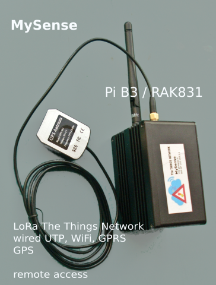
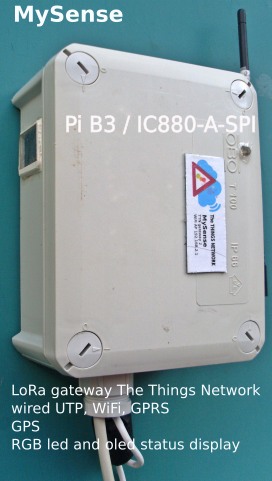

# LoRaWan Long Range Internet of Things
LoRaWan network for sensors coverage is needed to pick up the measurements data. Commercial coverage is provided. This might be a solution for a very limited amount of measurement nodes, but the advantage of using the free The Things Network should be considered due to technical arguments.

One LoRa gateway (a data forwarder) will have a coverage with an outdoor antenna will be 2.5 km or much more if there is free sight.
A commercial LoRa gateway will costs about € 750-1500. A DIY LoRa gateway is easy to configure for about € 120 (Pi/RAK831) up to € 170 (Pi/IC880A-SPI).

## DIY LoRa gateway

To build a DIY gateway one will find on internet many good instructions:
* <a href="https://webshop.ideetron.nl/iC880A-SPI"> Pi/IC880A-SPI</a>  € 115.- a quick start guide
* <a href="https://nl.aliexpress.com/item/RAK831-Pilot-Gateway-SX1301-Raspberry-Pi3-GPS-met-complete-behuizing-voor-professionele-demonstratie-set-up/32883987457.html">Pi/RAK831</a> via AliExpress € 120.- - 170.- with aluminium (indoor) housing
* <a href="https://github.com/ttn-zh/ic880a-gateway/wiki"> Github wiki</a> from zero to lorawan in a weekend
* <a href="https://www.thethingsnetwork.org/forum/t/the-hard-rak831-cafe-part-2/10576">the RAK831 way<a>
* <a href="https://www.thethingsnetwork.org/docs/gateways/rak831/">how to build lora gateway with rak831a</a>
* <a href="https://www.thethingsnetwork.org/forum/t/rak831-vs-ic880a-spi/12423">rak831 versus ic880a-spia</a>

The use of a header board (the wiring is just the board) is advised. If one uses wiring make sure to use a grounded shield for the data wiring. For both types of boards the software is very similar (SIMTECH).
The Pi software will use `/var/log/syslog` as logging file. This will grow and limit the lifetime of your SDcard. Hense an extra Python script to avoid this a bit, as well provide visual feedback of the status of the gateway.

With the MySense RPi `INSTALL.sh` configuration script one will find options to improve the functionality of the gateway:
- enable and use a GPS module
- automatic choice of interconnectivity: wired, WiFi, or GPRS (mobile)
- enable gateway as WiFi Access Point to configure local WiFi and do remote system configuration
- install remote access via internet for updating the software (ssh, Weave, TeamView, etc.)
- use of visiual feedback via oled display (SSD1306) and RGB led. See docs/display.md
- install webmin (remote system configuration)

## LoRa gateway script extensions
* *start.sh* This shell script is extended with commands to identify internet access, adjust GPS localisation configuration on the fly, provide visual feedback on the oled display and RGB led and limit the forwarder logging as well give statistical visual feedback.
* *GatewayLogDisplay.py* a log filter and visualisation of status and traffic statistics on the oled display and RGB led server `MyDisplayServer.py' (see RPi directory, install this script with INSTALL.sh).

## Concentrator errors
A frequent error `ERROR failed to start concentrator` is raised on the different fora. As more detailed of the rerason for the errors in the concentrator software is lacking some hints may be usefull:
* make sure the Pi has a good powersupply of 5V DC and is able to deliver 2.1A. Many adapaters say they are 2.1A but the reality is different.
* make sure the hardware reset pin 22 or other is really connected to the concentrator board and a separate script is doing the reset.
* make sure the user has GPIO full access rights.

Sometimes the errort is about wrong calibration version. The upload of the firmware probnably went wrong. E.g. use shielded cabling to the concentrator. Just a reboot may also cure this...

Make sure when you powerup the antenna is connected. If not it may destroy the concentrator board.
