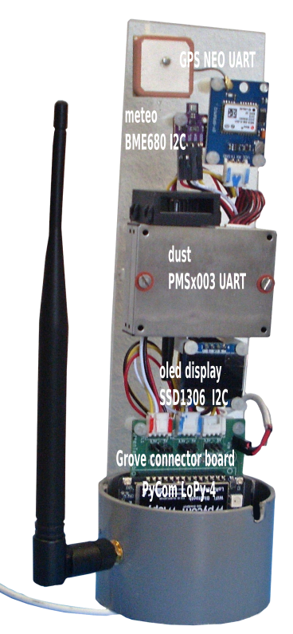
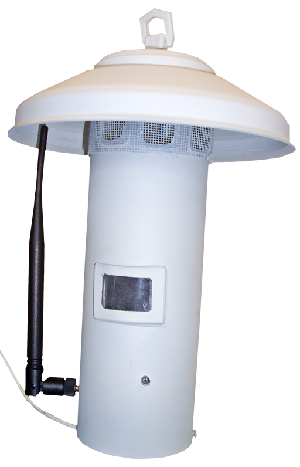

## Description
The LoPy is a low cost (€ 35) ESP controller which support micropython and has wifi, Bluetooth and LoRaWan or SigFox capabilities.


MySense is using the PyCom expansion board V3 (€ 16) for the manufacturer firmware flashing, developemnt wiring and programming. For operations we use an own expansion PCBV board with Grove connectors to eliminate wiring and connection errors.

MySense operates with TTN as LoRa dataconcentrator. MySense will check every 2.5 seconds (maximal 20 times) if a *join* with TTN LoRa network was succesfull.
A red flash will denote there was not a join yet.
On failure it will skip to send data measurements to TTN and will continue to show locally on the olded display the measurements.

For installation, and firmware update see:
* reference: https://docs.pycom.io

## LoPy-4 BME/SHT/GPS/SDS/PMS wiring

With the PCB connector board one may easily connect the sensor modules. There are 3 TTL and 3 I2C Grove connectors on this board. With a female Dupont socket one can easily connect to the sensor module. The MySense softwaree will automicaly detect which sensor modle is connected to the TTL ports and I2C ports.

Orientate the LoPy with the flash light up (if you use the recommanded development shield the small USB connecter will be on top). The name `pycom lopy` will face to the left side. The left side pins are numbererd top down as RST, P0, P1 ,...,P12.
The right side pins top down are numbered as: Vin V3.3/V5, Gnd, 3V3, P23, P22, ..., P13.


### TTL/UART devices connections
SDS011/PMS7003/PMSx003 TTL1 5V (LoPy TTL3) UART connection:
* PM Gnd (black) -> LoPy Gnd (on right side 2nd pin, same pin as for BME)
* PCB V2 (PCB BWLvC V2) to be checked with Config.py!
** PM V5 (red)    -> PCB V2: LoPy P19 PWR (on right side)
** PM Rx (yellow) -> PCB V2: LoPy P3 / Tx1 (on left side, 5th pin from top)
** PM Tx (white)  -> PCB V2: LoPy P4 / Rx1 (on left side, 6th pin from top)
* PCB V1 (PCB V1 GTL V1/V2) default (2019-02-27)
** PM V5 (red)    -> PCB V1: LoPy P20 PWR (on right side shared with console) dflt
** PM Rx (yellow) -> PCB V1: LoPy P10 / Tx1 (on left side, 5th pin from top) dlft
** PM Tx (white)  -> PCB V1: LoPy P11 / Rx1 (on left side, 6th pin from top) dlft

Grove GPS TTL2 3V3 (LoPy TTL2) Uart connection:
* GPS Gnd (black) -> LoPy Gnd (on right side, shared pin)
* GPS Vcc (red) -> LoPy 3V3 P9
* PCB V2 (PCB BWLvC V2) to be checked with Config.py!
** GPS Rx (green) -> LoPy P12 / Tx2 (on left side, 1st pin from bottom)
** GPS Tx (yellow) -> LoPy P11 / Rx2 (on left side, 2nd pin from bottom)
* PCB V1 (PCB GTL V1) default
** GPS Rx (green) -> LoPy P4 / Tx2 (on left side, 1st pin from bottom)
** GPS Tx (yellow) -> LoPy P3 / Rx2 (on left side, 2nd pin from bottom)

Console TTL TTL3 (LoPy TTL1) Uart connection (default):
* Gnd (black)
* 5V/3V3  (red) V1: P9 PWR used by TTL2 due to HW bug)
* Rx: P1
* Tx: P0

In `Config.py` one is able to define the pins. MySense will automatically detect on the defined UART pins the GPS and dust connector.

### I2C devices connections
SHT31/BME280/680 I2C  connection (default I2C address):
* BME Gnd (black) -> LoPy Gnd (on right side, same pin as for SDS)
* BME V3/5 (red) -> LoPy 3V3 (on right side, 3rd pin from top)
* BME SDA (white) -> LoPy SDA (on right side, 4th pin from top)
* BME SCL (yellow) -> LoPy CLK (on right side, 5th pin from top)
The oled SSD1306 display I2C bus is connected parallel to each other.

### Optional SPI device deprecated
Optional SSD1306 SPI connection (using GPIO pins):
* SSD CS (blue) -> LoPi P18
* SSD DC (purple) -> LoPy P20
* SSD RST (gray) -> LoPy P21
* SSD D1 (white) -> LoPy P17
* SSD D0 (orange) -> LoPy P19
* SSD VCC (red) -> LoPy 3V3 (shared with BME280)
* SSD GND (black) -> LoPy Gnd (on right side, same pin as for SDS)

### configuration pins
* P13 (Hall magnetic sensor) Use REPL mode (only PCB BWLvC V2)
* P17 Accu voltage (PCB V2) near TTL sockets (if 0V and deepsleep P18 closed: go into REPL modus)
* P18 Closed (gnd) use deepsleep (on PCB near I2C sockets)

Warning: SPI oled display seems not run with PyCom firmware 1.17.3.b1 (April 2018). A previous version was running ok.

## Housing
We used PVC pipe components available from DIY nearby warehousing. Basically an PVC air outlet pipe of 80 mm diameter, a 75 mm connection socket and a plexyglas for the sensor frame 3 X 61 X 230 mm.
For a cutting guide and drill mask see the SVG (Inkscape) files:
* images/MySense-LoRa-layout-lantern.svg
* images/MySense-lantern-pipe-cutting.svg

## Features: Remote command handling
A simple remote command via LoRa has been implemented: 
* ?: send configuration and GPS location info 
* O: switch oled display off
* d: enable to send dust raw data
* D: disable to send dust raw data
* m: enable to send raw meteo data
* M: disable to send raw meteo data
* S: stop
* i<unsigned int value>: value should be > 60 seconds, defines new sample interval time
* more to do
On a reboot the remote command is lost. (To Do: survive a reboot).

## Data collecting: TTN how to
You need to set up an account and password with The Things Network: https://thethingsnetwork.org/

Via the `console` add an application with a name: https://console.thethingsnetwork.org/applications/add
If done so, click on the added application name and register a device: 
://console.thethingsnetwork.org/applications/NAME_APPLICATION/devices/register
Write down the following OTAA information to be entered in the Config.py:
```python
dev_eui = "XXXXXXXXXXXXXXXX"
app_eui = "YYYYYYYYYYYYYYYY"
app_key = "ZZZZZZZZZZZZZZZZZZZZZZZZZZZZZZZZ"
```
MySense is also supporting the ABP mode with LoRa. Just define the ABP keys. If available MySense will first try OTAA and if unsuccessfull (or if keys are not defined) will try ABP mode.
If you want to access (and you want to do that during tests) the TTN MQTT server you need to write down the App ID (NAME_APPLICATION) and Access Key (bottom of the App Id page).

To Do: support MQTT access via WiFi.

## MySense test
MySense is supplying some simple test scripts to test LoRa, GPS, meteo, and dust sensors. Use xyz_test.py for this. E.g.:
'''
>>> import dust_test
'''
This enables you to test all modules and wiring one by one.

### Data format handling at TTN webiste server
Use the script `lora_test.py` to test your configuration and LoRa connectivity.
```python
    >>>import lora_test # this will send MySense info and MySense data
```
### Reading at TTN the data
Enter Java Script code to decode the payload format at TTN website via the console:
```java script
function Decoder(bytes, port) {
  // Decode an uplink message from a buffer
  // (array) of bytes to an object of fields.
  var decoded = {};

  // if (port === 3) meta data
  // if ( port === 2 ) or (port === 4) for sensor data to json format
  ...
}
```
Try this with a payload as showed on the tab 'data'.

The payload can be decoded with the JavaScript as in the file `TTN-decode.js`. Try this with some test payloads before you make fully operational.

### how to collect the data from TTN MQTT server
Here is an example how your sensor kit will show at the TTN MQTT server via the command:
```bash
mosquitto_sub -v -h eu.thethings.network -p 1883 -u "$APPID" -P "$ACCES_KEY"  -t '+/devices/+/up'
```

The json string from the server, something like:
```json
2021802118025917/devices/lopyprototype/up {
    "app_id":"20215z","dev_id":"lopyprototype","hardware_serial":"D495613",
    "port":2,"counter":25,
    "payload_raw":"AfsBBAP/ADkANA==",
    "payload_fields":{ 'temperature': -12.3, 'humidity': 80, ...
        "utime": 12345678
    },
    "metadata":{
        "time":"2018-02-23T19:49:29.919556985Z","frequency":868.5,
        "modulation":"LORA","data_rate":"SF7BW125","airtime":61696000,
        "coding_rate":"4/5","gateways":[
            {"gtw_id":"eui-b827befff65b8e9","timestamp":1663804715,
            "time":"2018-02-23T19:49:29.891823Z",
            "channel":2,"rssi":-37,"snr":7.8,"rf_chain":1,
            "latitude":15.40283,"longitude":2.15341,"altitude":230}
    ]}}
```

Use the Java Script `payloadformat.js` to decode the payloads.

### LoRa port usage
The LoRa connect routine supports to open more ports as the default LoRa port 2. Use the argument: `ports=3` to open 3 ports. The LoRa send routine supports an argument to discriminate to which port to send the payload.
Currently ports used by MySense:
* port 2 (default) to send measurement data: PM2.5, PM10, temp, humidity, pressure, unix timestamp, etc.
* port 3 to send meta data as which sensors and location if available.

The LoRa implementation supports to collect data sent to the sensor kit. Define the argument `callback=commandRoutine` on the connect initialisation. The callback rooutin on reception of data on any LoRa port will be called as: `commandRoutine(port,receieved_data)`. See lora_test.py for examples. 

### RGB led signals
The MySense routine (loop) will provide some basic signaling via RGB led:
* orange/blue repeat 3: Go into REPL console modus (use wifi to direct access)
* red/orange repeat 3: low battery
* green repeat 2: reach sensing end sequence, LoRa joined, sensor successfull
* purple: sensor error
* red: no sensor found, no LoRa join 
* blue repeat 4: LoRa join success
* blue repeat 1: send LoRa
* green,orange: go into seepsleep
* 
