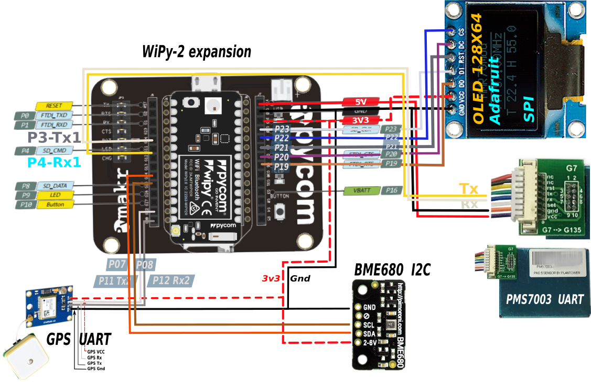

## WiPy-4 BME/SDS wiring

Orientate the WiPy with the flash light up (if you use the recommanded development shield the small USB connecter will be on top).
The name `pycom wipy` will face to the left side. The left side pins are numbererd top down as RST, P0, P1 ,...,P12.
The right side pins top down are numbered as: Vin V3.3/V5, Gnd, 3V3, P23, P22, ..., P13.

PMS7003 TTL Uart connection:
* PMS Gnd (black) -> WiPy-exp Gnd (on right side 2nd pin, same pin as for BME)
* PMS V5 (red) -> WiPy-exp V5 (on right side, top pin)
* PMS Rx (white) -> WiPy-exp P3 / Tx1 (on left side, 5th pin from top)
* PMS Tx (yellow)-> WiPy-exp P4 / Rx1 (on left side, 6th pin from top)

BME680 I2C  connection (default I2C address):
* BME Gnd (black) -> WiPy-exp Gnd (on right side, same pin as for SDS)
* BME V3/5 (red) -> WiPy-exp 3V3 (on right side, 3rd pin from top)
* BME SDA (orange) -> WiPy-exp SDA P7 (on left side, 6th pin from bottom)
* BME SCL (brown) -> WiPy-exp CLK P8 (on left side, 5th pin from bottom)

SSD1306 SPI connection (using GPIO pins):
* SSD CS (blue) -> WiPy-exp P22
* SSD DC (purple) -> WiPy-exp P20
* SSD RST (gray) -> WiPy-exp P21
* SSD D1 (white) -> WiPy-exp P23
* SSD D0 (orange) -> WiPy-exp P19
* SSD VCC (red) -> WiPy-exp 3V3 (shared with BME680)
* SSD GND (black) -> WiPy-exp Gnd (on right side, same pin as for BME)

GPS module Uart connection:
* GPS VCC (red) -> WiPy-exp 3V3 (shared with BME680)
* GPS Rx (white) -> WiPy-exp P11 (Tx 2)
* GPS Tx (gray) -> WiPy-exp P12 (Rx 2)
* GPS Gnd (black) -> WiPy-exp Gnd (on right sode, shared with BME)

## To Do
MQTT

## MQTT how to
to do
