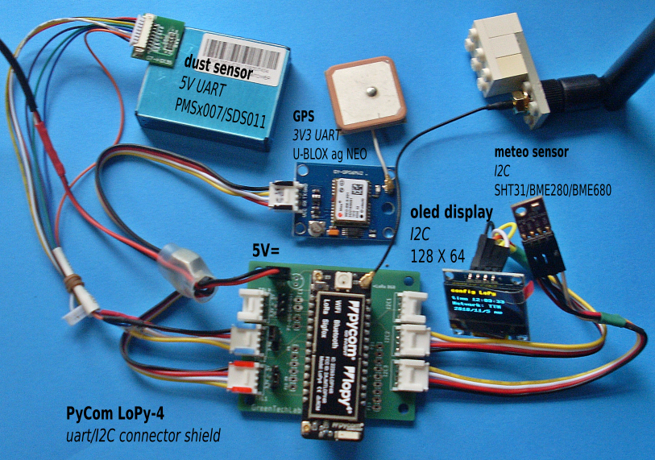
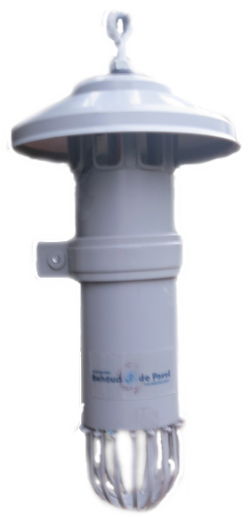
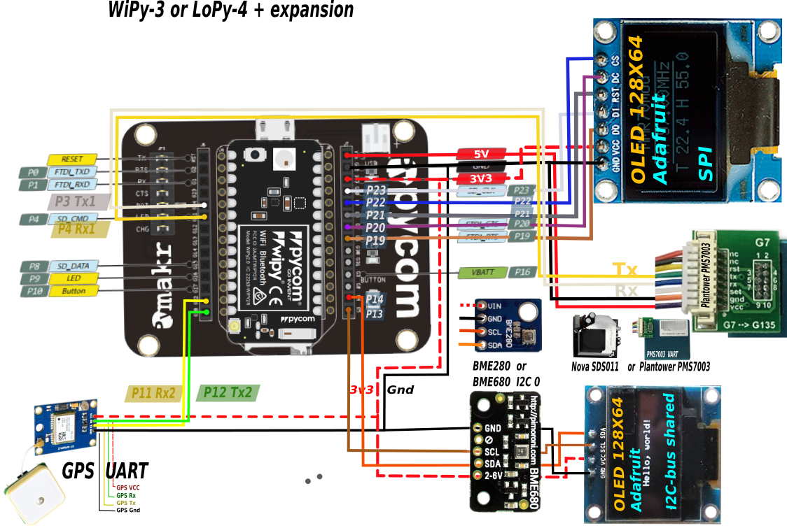

# PyCom LoPy or WiPy  BME280/BME680 SDS011/PMS7003 GPS  MySense sensor kit

Status: *beta* 2018/04/02

Simple low cost (€120) satellites sensor kits.

## Shopping list
* PyCom LoPy-4 controller  PYCLOPY4 (Tinytronics  € 42.-)
* optional LoPy Expansie board 2.0 PYCEXPBOARD2.0 (Tinytronics € 19.-) (development board)
* LoPy-Sigfox antenne kit 868 Mhz PYCLOSIAN868KIT (Tinytronics € 10.50)
* optional SSD1306 I2C Yellow/Blue 128X64 oled display (AliExpress € 2.23, Tinytronics € 9.50)
* optional Plantower PMSx003 laser PM sensor with G7 cable!) (AliExpress € 15.17)
Plantower has a new PMSA003 (black) which has cleaning support and tube inlet (€ 80).
Alternative is Nova SDS011 (bigger, less PM types, but has air inlet tube connection)
* optional GY-NE06MV2 NEO-6M GPS module TTL connection (AliExpress € 5.15)
* optional Sensirion SHT31 (AliExpress € 2), BME280 (AliExpress € 3.50), or better BME680 I2C (has gas sensor, AliExpress € 10.50) meteo sensor (do not use I2C/TTL BME680, I2C bus errors)
* longer USB adapter cable 2-3 meter (Action € 1.50)
* USB V220 AC-5V= adapter (Action € 2.10)
* wiring: per module 4 wires: female/male for 4 modules:
2 packs Dupont jumpercables 20cm 10 per package (2 X € 1.50 Tinytronics)
Remark: better to create a UART/I2C connector shield with Grove sockets and connectors. See the picture. Board design with Grove sockets is available.
* assortiment thrink tubes (2.5 mm and bigger) (€ 3.45 Ben's Electronics)
* V220 outdoor cablebox 10X12.5 cm, larger is better eg OBO T100 or T160. (electroshop.nl € 5.39)
Or use PVC pipes and roof air outlet exhaust. Advised is to paint it white and use double pipes for heat isolation.

Some fixing materials:
* small piece of plexiglas for cover oled display
* 2 component glue
* some fixing tool to stabalize the antenna
* 4 cm tube for air inlet of PM module (SDS011 or black PMSA003)
* piece of wood to be able to attach the outdoor cable box on a wall.
* some material to fixate the components and allow airflow in the box



### TTN gateway

DIY or buy one.

You may be unlucky and do not have a TTN infrastructure in the neighbourhood. However it is easy to build one your self with Pi controller, an IC880-SPI or RAK831 concentrator, pigtail and antenna in some  casing, ca € 2000-230, Ideetron.nl or AliExpress) or buy one (ca € 350 (TTN gateway via Ideetron.nl) or higher € 450-1.200).
See for how-to instructions:
* IC880a-SPI concentrator: https://github.com/ttn-zh/ic880a-gateway/wiki
* https://github.com/Lora-net/lora_gateway#readme
* RAK831 concentrator: https://www.thethingsnetwork.org/labs/story/rak831-lora-gateway-from-package-to-online

For MySense we changed the `/opt/ttn-gateway/bin/start.sh`, added WiFi access point for WEBMIN (use `INSTALL.sh WEBMIN` and Raspberry Pi OS configuratio (see `INSTALL.sh help`), and to log concentraor log messages to the oled display via the filter `GatewayLogDisplay.py`. The scripts can be found in the map LoRa.

The TTN ZH Pi based shopping list (we bought a ready to go gateway Pi2 based from IMST and changed the software to TTN for € 250):
* Pi Zero or 3, poweradapter, minimal 4GB SDcard € 42 Tinytronics.nl 
* iC880A-SPI concentrator board (<a href="http://shop.imst.de/wireless-modules/lora-products/8/ic880a-spi-lorawan-concentrator-868-mhz" alt="IMST webshop">IMST websop CH</a>) € 120 (ideetron.nl).
* 868 MHz anternna and pigtail € 10
* 7 Dupont wires (female/female) € 1
* enclosure e.g. OBO T160 V220 cable box € 10
* optional outdoor antenna with fuse(!) € 75 (ideetron.nl)

or:
* RAK831 in case via AliExpress, which has GPS antenna and a too small LoRa antenna: € 178.
The alluminium case does not allow WiFi signal of the on board chip to reach outside of the case. For WiFi you may need a USB WiFi dongle. If so make sure the dongle is able to be used as WiFi access point as well as WiFi client.
* 6 dB glasfiber antenna via AliExpress: € 29
For Europe make sure you have a 868MHz version (use with AliExpress the color option).

For both types of boards install the ttn-gateway software from `apt install git; git clone https://github.com/ttn-zh/ic880a.git/ ~/ic880a-gateway`.
Make always sure antenna is placed before you start to use the gateway! A start without the antenna connected will distroy the concentrator board.
Configuration hint for software: make sure the right reset pin number of GPIO Pi is used (see start.sh shell command file, and do not use initialy the remote concentrator configuration.
The concentrator board needs always to be reset before starting up the forwarding software.

## DESCRIPTION
The sensor kits are build with PyCom (loPy-4 and WiPy-3) ESP controllers and PyCom expansion board.


The controller has on board WiFi, BlueTooth and for LoPy LoRa. Use an external LoRa Wan 868/915 LoRa antenna on the LoPy.
The PyCom controller can be programmed via embedded micropython.
To access the board use the Atom with the Pymakr plugin.
Atom is interfacing either via WiFi (192.168.4.1) or serial (USB) connection to the controller.

The goal is to use the PyCom ESP as controller for MySense sensor satallite kits. Measuring dust, rel. humidity and GPS to forward this to Mosquitto database (WiFi) or LoRa data concentrator. From which the MySense configured as proxy can pick up sensor data to the MySense databases.

Datacommunication is done via WiFi (Mosquitto), or LoRa (TTN MQTT data concentrator) and MySense Raspberry Pi  in server mode.
One may send data via MySense Pi server to RIVM in the Netherlands as well Luftdata in Germany.

### measurement data
The MySense kit will collect measurements from dust (Nova SDS011 and Plantower PMS7003) sensors and meteo (BME280 or BME680 with air quality support) sensors and send this data either via wifi or LoRaWan (TTN) Mosquitto (MQTT) dataconcentrator. Dust measurements will be collected over a sample time (default 1 minute) and send to the data concentraor at interval (default 5 minutes) periods of time. Fan and laser of the dust sensors will be powered off in the idle periods of time.

The MySense server will collect this information from the MQTT servers and formward these measurements and meta data to e.g. a MySQL database, spreadsheet or another data stream service.

### remote management
The LoRa MySense part is supporting remote control via TTN. The following remote commands are supported yet:
* '?': send version, configuration and location details to TTN MQTT server
* 'O': switch the oled display if present OFF (dflt ON)
* 'S': stop processing (to do: put node to deep sleep)
* 'i'-value : change the sample interval time to value seconds (dflt: 5 minutes)
* 'd' or 'D': turn dust sensor calibration OFF or ON
* 'm' or 'M': turn meteo sensor calibration OFF or ON
* 'w' or 'W': turn dust sensor to weight modus
* '#': turn dust sensor to partical count modus (if dust sensor supports it)
* to be extended e.g. meta updateMin and updateMax information frequencies.

### Meta information
The PyCom MySense kit will send on start and at specific `updateMax` (default 6 hours) intervals *kit information* (type of used sensors) and *GPS location* separately from the data stream to the data concentrator (LoRa port 3).
If the GPS modules is installed the controller will (re)sent this location information at the moment (`updateMin`: dfault minimal frequency is 7 minutes) a location change is detected (default 50 meters).

## PyCom programming
The PyCom boards are using MicroPython (see http://docs.micropython.org/en/latest/pyboard/).
MicroPython is an embedded Python 3 alike scripting language.

## WiFi SECURITY
Default the PyCom board will enable WiFi as Access Point with standard public known access passwords en telnet/ftp credentials. MAKE SURE you change this to avoid the use of the controller by anyone. See how to's:
* https://docs.pycom.io/chapter/tutorials/all/wlan.html
* Adafruit and https://mike632t.wordpress.com/2017/04/11/connecting-my-wipy-to-my-wifi/:

How to connect the PyCom to your own network (defeat: you will ONLY be able to control the PyCom from remote within the range of your wifi).
Hint: only change ftp/telnet user/password ...

Create a `boot.py` file with the following content:
```Python
    import os
    import machine
    import network
    import time
   
    # Duplicate output on UART
    uart = machine.UART(0, 115200)
    os.dupterm(uart)
  
    # Disable telnet and FTP server before connecting to the network
    server = network.Server()
    server.deinit()
   
    # Connect to WLAN
    wlan = network.WLAN()
    wlan = network.WLAN(mode=network.WLAN.STA)
    nets = wlan.scan()
    for net in nets:
      if net.ssid == '<YOUR OWN PYCOM ssid>':
        wlan.connect(net.ssid, auth=(net.sec, '<YOUR WiFi wireless-password>'),
          timeout=5000)
      while not wlan.isconnected():
        machine.idle() # save power while waiting
  
    # Enable telnet and FTP server with new settings
    server.init(login=('<YOU/user>', '<YOU/password>'), timeout=600)
    time.sleep(10) # Wait 10 seconds before continuing
```
And load up via FTP the boot.py to the board.

### How to interact with the PyCom board?
Install *atom* from http:atom.io (PyCom): for Debian systems download the IDE application with extension .deb and install via `dpkg -i atom-XYZ.deb` and the pymakr plugin from the PyMakr github: `git clone https://github.com/pycom/Pymakr` (read the README.md!), optionally install *apm*, and run in the cloned directory `apm install`. Copy all contents to a new directory `~/.atom/packages/PyMakr`. This will install a PyCom board IDE (development tooling).

Or use an alternative *rshell* (Python 3 tool)from: https://github.com/dhylands/rshell. Read the rshell README file how one can use this command line tool to upload, download and use REPL.

The PyCom controller will run on power ON `/flash/boot.py' and `/flash/main.py`. If not you can interact via atom with the controller. In the directory `/flash` ('home' directory) your scripts should reside.
Push and keep it pushed the *user* button on the expansion board first and while pushing push the *reset* button on the controller will reboot the controller but will not run boot.py as well main.py. The other way is to press <cntrl>C on the keypboard (keyboard interrupt).

In the PyCom folder you will see some main scripts. The libraries for the sensor modules are in the lib folder. Copy the main scripts to the 'LoRa/firmware' directory, as well the needed libraries (see the statement *import* in the used scripts) to the *lib* directory. Point *atom* as new project to the configured *firmware* directory and press 'sync' or 'reload' button to load the files into the PyCom controller.

The PyCom board can be accessed to change the firmware either via WiFi (see the PyCom documentation) and/or USB of the PyCom expansion board.
* Debian: make sure you have access to `/dev/ttyACM0` or `/dev/ttyUSB0`. Use the Linux command `lsusb` and see if *Microchip Technology, Inc.* is present. If not see what the problem might be via `/var/log/syslog`. In one occation we had to do create the `/etc/udev/rules.d/49-micropython.rules` with the content:
```
# idVendor=04d8, idProduct=ef98 PyCom
ATTRS{idVendor}=="04d8", ATTRS{idProduct}=="ef98", ENV{ID_MM_DEVICE_IGNORE}="1"
ATTRS{idVendor}=="04d8", ATTRS{idProduct}=="ef98", ENV{MTP_NO_PROBE}="1"
SUBSYSTEMS=="usb", ATTRS{idVendor}=="04d8", ATTRS{idProduct}=="ef98", MODE:="0666"
KERNEL=="ttyACM*", ATTRS{idVendor}=="04d8", ATTRS{idProduct}=="ef98", MODE:="0666"
```
Disconnecet the PyCom USB cable, issue `sudo udevadm control --reload-rules` and reconnect the USB cable to the expansion board. 

## MySense satellite sensor kits
The MySense satellite sensor kits are less powerfull and build around the Marvin and PyCom ESP controllers.
The PyCom scripts have the following structure: 
* sensor module scripts which reside in the lib folder
* Config.py which describes which module is used and how it is wired. It is used by the other scripts
* sensor test scripts named as {meteo,dust,gps,ssd1306}_test.py for testing the harware
* the main script *MySense.py* for operational use.

### tested MySense sensor modules
Choose one meteo and one dust sensor: MySense modules in development are:
* SHT31 meteo: temp and humidity on I2C bus
* BME280 meteo: temp, humidity and pressure on I2C bus
* BME680 meteo: temp, humidity, pressure and air quality on I2C bus
  One serie of BME680 I2C/TTL modules are causing I2C bus errors.
* PMSx003 (black one) dust: PM1, PM2.5 and PM10 on UART TTL (no USB)
* SDS011 dust: PM2.5 and PM10 on UART TTL (no USB)
* GPS location: UART TTL (no USB)
* SSD1306 tiny oled display: 128X64 pixels on GPIO bus or I2C bus.
* LoRaWan: using TTN
* MQTT: not implemented yet

Comment: do not use eg UART Rx on pin 12. Pin 12 high on reset will cause to omit executing boot.py and main.py.
Maximum of UART modules is 2 (e.g. dust and GPS modules).

To test I2C wiring use the following EXP commands:
```
    SDA='P23'
    SCL='P22'
    from machine import I2C
    i2c = I2C(0,I2C.MASTER,pins=(SDA,SCL))
    i2c.scan()
```
This should return the I2C registers as e.g. `[60]` (decimal!) for the I2C address of a BME280. If `[]` there is no I2C module attached to the pins. Or if it hangs wiring is wrong.
If the scan produces unexpected extra register address values please check your I2C modules to avoid I2C bus errors.

From release version 3 MySense will auto detect I2C devices on maximal 3 I2C busses.

### wiring PyCom <-> devices
Advised is to use strict colors: *red* for 5V, *orange* for 3V3 and *black* for Ground.
Use *white* (SCL or controller Rx) and *yellow* (SDA or controller Tx) for data wires.
We use Grove connectors with female Dupont connectors. Our connector board has Grove sockets which lead to the right pins of the PyCom controller: TTL (5V or 3V3) and I2C devices (3V3).
#### Uart or TTL devices
E.g. GPS (3V3) and dust sensors (5V). 
Examples:
```
    GPS 3V3, Tx yellow wire - PyCom Rx Pin P10 (unused)
             Rx white wire  - PyCom Tx Pin P11
    Dust 5V, Tx yellow wire - PyCom Rx Pin P3
             Rx white wire  - PyCom Tx Pin P4
'''
The PyCom has P0 Tx pin and P1 Rx pin (expansion board USB connected) for a 3rd TTL e.g. Spec TTL NO2 sensor. To Do: add Spec gas sensor driver.

MySense support auto UART device recognition for GPS and dust sensors (SDS011, PMSx007 serie). See the `Config.py` file for details how to enable/disable ato configuration.
The UART pins may be defined (tuples: (white wire Tx,yellow wire Rx) -> device (Rx,Tx)) if not default pins (P4,P3),(P11,P10) are used.

#### I2C for sensors and oled display
All I2C are parallel in this example. SDA is I2C data wire, SCL is I2C clock wire.
```
    device 3V3, SDA white wire  PyCom SDA Pin P23
                SCL yellow wire PyCom SCL Pin P22
```
MySense will scan the I2C bus(ses) for auto configuration of known I2C devices (oled display and various meteo sensors). I2C pins are defined as tuples (white wire SDA, yellow wire SCL), default: (P23,P22).

## remarks
BME280 or BME680 meteo sensors are tuned for indoor applications. Lifetime of sensors differ much because of this. The DHT11 or DHT22 are worse for outdoor application usage and should not be applied.
An alterrnative is to use the Sensirion SHT21 or SHT31 I2C module (only temp and RH). The SHT sensor seems to cause I2C bus errors regularly.

The dust sensors have a fan and laser. Both have a limited time of life. Hence the fan and laser are powered off in idle state. It is unclear if this method will help to improve the lifetime.

To Do: auto detect UART devices.

### RTC clock
MySense will use GPS to initilyse the Real Time Clock module. Every time the GPS location is looked up the RTC clock will be updated automatically.
This will allow MySense to timestamp measurements more precise.

### MySense satellite LoRa kit configuration
Use the file `Config.py` to define which sensors are configured for the kit. Have a good look at the *pin*s definitions and bus used for the sensor. The `Config.py` file should reside in the *firmware* directory in order to upload it to the controller.

If `dev_eui, app_eui and app_key` is defined in `Config.py` the LoRaWan On The Air Authentication (OTAA) method will be tried first to join with 4 X 15 secs a wait for authorisation.
If not defined or the join did not complete the ABP method will be used with the configured `dev_addr, nwk_swkey and app_swkey` in `Config.py`. With method ABP MySense will not wait for authorisation.

Do not change the order in the `Meteo` and `Dust` array definition!

### Testing hardware
MySense has provided several simple XYZ_test.py python scripts to test the sensor modules for needed libraries and check of wiring.
Make sure to configure the right pin ID's in `Config.py` configuration file for the test scripts.

Test your setup one by one before trying out the main wrapper `MySense.py` via *MySense.runMe()* or `main.py`.

## Your First Steps
* visit the PyCom.io website and follow the installation guide
The following is an outline how we do the developments and module testing:
* Add the expansion board to the PyCom LoPy or WiPy module. Make sure about the orientations.
* hook up the module (USB or via wifi) to your desktop and upgrade the firmware.
* disconnect the expansion/PyCom module from power and only wire up one module.
* Install hardware and sonfware one by one: say the first one is XXX (e.g. BME280)
* copy the dependent XXX_test.py, Config.py and library module XXX.py to resp. XxPy/firmware and XxPy/firmware/lib.
* adjust the Config.py for the right pin setup wiring. And check this twice.
* Click on the *Upload* button of atom to load the scripts into the PyCom module. This will synchronise all files in the firmware directory of your desktop with the PyCom ESP controller.
* fireup XXX_test as follows:
```python
>>>import XXX_test
```
* if not successfully copy/paste the statements of XXX_test.py one by one via atom REPL.

* on success do the next module e.g. PMS7003 wiring and redo the test cycle.
* on success try out `MySense.py` and finally install `main.py`:
```python
    import MySense
    MySense.runMe()
```
* and give feedback

## MySense scripts
The main micropython script which drives the sensor kit is `MySense.py`. Use `main.py` to import MySense.py and run `MySense.runMe()` to run the kit.

The micropython (looks like Python 3) script uses the Adafruit BME280 and BME680 (I2C-bus) python module, SDS011 (Uart 1) module from Rex Fue Feinstaub `https://github.com/rexfue/Feinstaub_LoPy` and Telenor weather station `https://github.com/TelenorStartIoT/lorawan-weather-station` and SSD1306 (Adafruit tiny display SPI-bus).

In the test phase one should not download main.py to the LoPy controller. Use `MySense.py` in this phase instead and rename it to main.py later.
Use (open) the directory `firmware` as base for the atom project and upload all file by pressing the upload key.
On the console prompt `>>>` use the following:
```python
import MySense
MySense.runMe()
```
After this initial test rename MySense.py to main.py. And upload main.py to the LoPy.

## I2C bus errors
The I2C together with SPI will cause I2C bus errors. After using the SPI SSD1306 display before the I2C bus can be used initialize the I2C bus first.

### how to reset the controller
You can delete old firmware using the instruction by PyCom. Usualy you only need to delete all uploaded file as follows:

Use the reset button on the LoPy to get the atom prompt `>>>` and do the following:
```python
    import os
    os.mkfs('/flash')
```
And upload your new files.

How to delete or enable previous firmware? Connect Pin P12 to 3V3: 1-3 sec (safe boot), 4-6 secs (previous user update selected), 7-9 secs (safe boot factory firmware).
P2 - Gnd low level bootloader (needed to update factory firmware upgrade).

The controller can always be reached via the network. Upload wifi (`www.pycom.io`) an empty main.py into `flash` folder with ftp (insecure version) ore `filezilla` (MacOs; can take some minutes to establish connection) in passive mode to `192.168.4.1` and user/pass `micro/python` to obtain access via telnet (or netcat) or USB.

### test PyCom controller
The PyCom will initiate the wifi. Use Wifi AO with pass: www.pycom.io and telnet (192.168.4.1) access user/password micro/python.

Make sure you have to upgrade the PyCom controller first. However upgrading LoPy-4 failed somehow.

Simple test to silence the blue flashing, at the prompt `>>>`:
```python
    import pycom
    pycom.heartbeat(False) # silence the blue flash
    pycom.rgbled(0x99ff55) # some color
    pycom.rgbled(0x000000) # led OFF
```

## MySense controller status
The console will print status as will the flashing led on the LoPy will flash different collors: red to establish LoRa connectivity, blue when LoRa is ready, green when measuremnts are arriving, and blue when data is sent, and white when SDS011 fan is turned off to save the fan and laser as well LoPy is in idle state. LoPy will send every 5 minutes (`sleep_time`) a measurement sample  to the TTN data concentrator.

## controller wiring



See for examples of wiring the `README.LopY.md` (LoRaWan TTN, BME280, SDS011 and SSD1306) or `README.WiPy.md` (wifi MQTT, BME680, PMS7003, SSD1306) readme's.

## To Do
Add more sensor modules. The Shiney PPD42NS (unreliable and too much errors), DHT22 and DHT11 (too much peaks and outdoor time to live too short) meteo sensor are depricated. Sensirion SHT31 (only temperature and RH, not very precise).
Note: The Plantower PMS7003 is much smaller and consumes less energy as the Nova SDS011 (has a nice air inlet). The Plantower PMSA003 (black one) has detachable fan, air tube inlet, cleanable inlet, and is more robust.

## Licensing
If not noted the scripts and changes to external scripts are GPL V3.

## some references
* https://kapusta.cc/2017/12/02/home-made-air-quality-monitoring-using-wipy/
