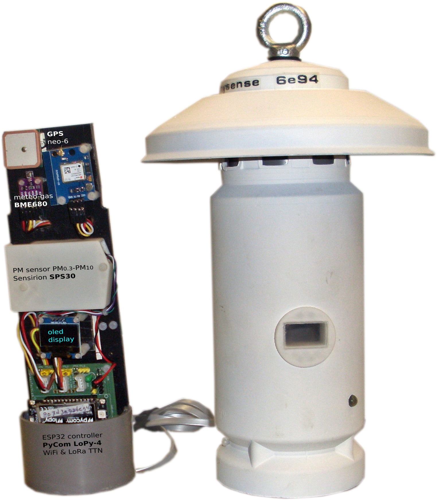
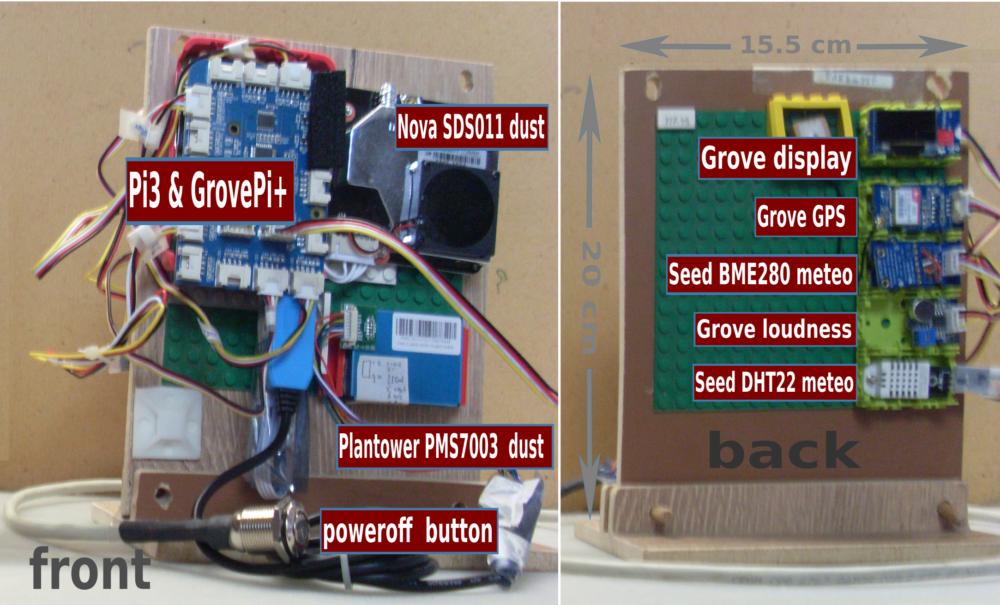
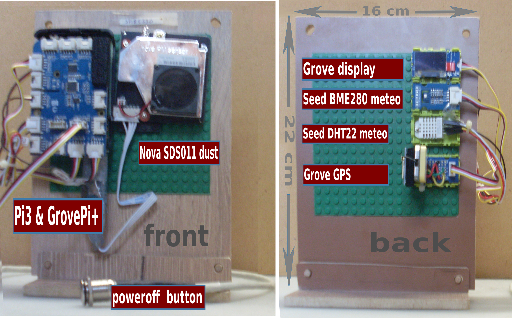
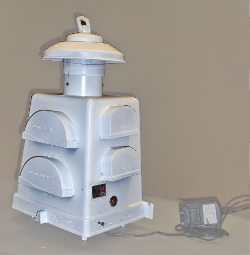
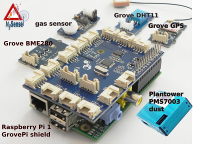

# MySense
Last update of the README on 4th of June 2019

## Description
Software Infrastructure or framework for managing environmental sensors and data aquisition.

### MySense Raspberry Pi controller


MySense is able to act as *air quality measurement kit* or *node broker* (Pi based).
As measurement kit MySense will collect measurements from dust,
gas and/or gas sensors and location sensor,
and forward the data to an external data concentrator(s) (database(s), as well as data broker as eg mosquitto and influx),
files eg spreadsheets,
and display (Adafruit tiny display or console).

As dataconcentrator MySense will connect to other data concentrator instead of collecting the data from sensors.

Two different controllers for the kits are supported:
1. Raspberry Pi for a high degree of functionality and easy block building reasons, while using lan/wifi/G4 as communication channel and
2. ESP32 LoPy controller (micro python) from PyCom when only a very few sensors can be hooked up. This kit uses LoRaWan as communication infrastructure via a public TTN server.
This measurement kit is in beta test since June 2019. The PyCom folder will show latest firmware snapshot.

The bus used for sensors are: USB (Pi: serial), TTL, GPIO (SPI) and I2C.
The scripts are all written in Python 2/3.

Visual feedback is provided with led/button (power On/Off) and optional an Oled display (64X128).

### MySense LoPy-4 PyCom controller



MySense sensor kits can also be applied as *air quality satellite* sensorkits. E.g. using LoPy or WiPy PyCom controllers with GPS, dust and meteo sensors.
In this case the data will be forwarded to <a href="https://www.thethingsnetwork.org/docs/lorawan/">LoRaWan</a> dataconcentrators as eg The Things Network or Mosquitto server.
The LopY has support for SiGFox (due to proprietary chracter of this method it has been deprecated).
The upload of uptaes to the firmware via PyCom OTA is planned.
Currently OTA (Over the Air update) is supported via a new firmware load via wifi.

MySense (Pi based) in data concentrator mode has the possiblity to collect these measurements data from e.g. the TTN MQTT dataconcentrator.

The bus used for sensors are: UART (serial), I2C and GPIO.

The scripts are written in (embedded) micro Python. Micro python has more functionality as the language C e.g. used with Arduino boards.

The Marvin ESP controller has been deprecated due to a problem with on board LoRa antenna in outdoor conditions.

Visual feedback is provided with RGB led and optional an 128X64 oled display.

The LoPy based measurement kit supports to run with a solarcel and accu. For enabling this the architecture has had a major redesign. The softwqare manages accu load as well tries to minimilize energy as much as possible.

The LoRa directory will give information to build a DIY TTN LoRa gateway.

The `INSTALL.sh` RPi configuration script will support to install GPS, oled display, RGB led, WiFi remote access, G4 access and other standard functionality to a Raspberry Pi based gateway e.g. RAK831, RAK833 or IC880a-PSI and Pi based gateway for a small budget TTN gateway.
Have a look at the RAK7258 LoRa gateway. A complete (indoor and outdoor) gateway for about €140 (AliExpress). As such providing you with more functionality as commercial offered gateways without a subscription fee.
If needed use a (€ 40) SIM router to connect the gateway to mobile data access.

At this moment we have 20 measurements MySense LoRa kits in the region running.
Seven kits run with solar cells around a cattle enterprise. The entrepeneur uses the outcome of data to minimize the emissions.

## Goal
Provide a generalised dynamic high quality Open Source based air quality monitoring infrastructure to allow:
* environmental measurements with high end standard off the shelf sensors
* data acquisition
* dynamic transport of data to other data systems: e.g. databases, mosquitto, Influx,...
* data storage and archiving
* access for free visualisation of local emissions
* free availability  of the data
* free availability of all software (under GPLV3 license, improvements of software remains in the public domain)

The project is run by volunteers on a non-profit basis.

## Supported functionalities
Major functionalities will be added on the fly.
Much is dependent on the quality of the applied sensors and visualisation possibilities of the data.
* supported dust sensors: Nova (only PM2.5, PM10), Plantower (PM1, PM2.5, PM10, counters PM0.3 up to PM10, average grain size, advised), Sensirion (PM1, PM2.5,PM10, counters PM0.3 up to PM10, average grain size, advised).
PM count data is needed to allow a much improved calibration. PM sensors providing only mass values are discouraged. PM sensors (some Plantowers and Sensirion sensors) for outdoor and non condensing conditions are encouraged.
* meteo sensors: Adafruit (DHT: temperature and humidity, deprecated due to humidity problems), Bosh (BME: temperature, humidity, air pressure and air quality), Sensirion (SHT: temperature, humidity). Humidity is a must for calibration of dust measurement.
* TTL or I2C interface to other sensors using standard Grove connectors. Use the standard API to standard product driver via Python. E.g. I2C anemometer, I2C/TTL gas sensors, etc.
* solarcel and battery management (deepsleep and battery low level warning).
* calibration on product base as well on measurement base to enable calibration.
* GPS to support proper localisation. Mobile is supported.
* communication with LAN, Wifi (discouraged due to high failure rate), G4 mobile data, and (TTN) IoT LoRaWan.
* visualisation of the measurements and current status via a display.
* auto detection of connected sensors: plug and play
* remote control and wakeup
* remote OTA update
* dynamic sampling and interval of measurements
* notices based warning system
* visualisation of graphs for (Drupal) website with HighCharts garaphics
* measurement and kist configuration archiving with MySql database.
* scalability
* simple adaptation of new sensors
* modular architecture and high level programming (scripting) to remain state of the art
* stanbard data interfaces (e.g. json, mosquitto, influx)

## Discussion
MySense supports calibration of every single sensor. Sensor values will differ between the sensors within a branche and between branches. Correlation software is included. Advised is to calibrate the sensors regularly for a test period of several days (conditions should vary in the test period).

Dust measurements are done by counting the particles. The most common dust sensor is the Nova SDS011. The Plantower PMSn003 (PMS7003 indoor and PMSx007 outdoor) and Sensirion SPS30 are however 1/3 in size and counts more classes of particles as well provides also the raw (real partical count) values. All have a fan and laser which are powered off in idle state.
The SPS30 is small, use less energy but has air inlet and outlet aside of each other.
Outdoor PM sensors have a higher cost price (2X or even 4X higher).

Dust measurements are (expnential) influenced by humidity.
A correction algorithm to enable to compare the dust measurements with reference sensor equipment (e.g. MetOne BAM-1020) is in beta test (start of 2019).
There is a plan for scientific statistical calibration report together with Uni Leiden, RIVM and Scapeler.
The plan is to be able to forecast PM levels for a short coming period as well.

<div style='vertical-align: top; clear: both'>
<figure>


<br />MySense sensor kits examples
</figure>
</div>
<p>

## How to start MySense on the RPi
* Create MySense user e.g. `ios` and login as this user.
* Install the software on e.g. the Raspberry Pi 3 on a new user e.g. `ios` in the directory e.g. `MySense`. Use `INSTALL.sh` to install all dependencies and startup scripts.
* Configure MySense.conf using MySense.conf.example as a lead.
* Test one by one the input and output scripts in the python debugger as standalone e.g. `pdb MySDS011.py`. Once this is tested, go to the next step.
* command line start and control (<cntrlZ> followed by kill %1 will stop the process): Run Mysense as follows `python MySense.py` and you will see all output on your screen.
* If you use a tiny display: start the display server: `python MyDisplayServer.py start`
* Start as daemon process. Start up MySense: `python MySense.py start`
When first started make sure you configure console output channel, logging to stdout or stderr and logging debug level.

If needed See the README files and documentation files in `docs` for more detailed info.

If you installed a led switch (controlled by `/usr/local/bin/poweroff`:
* Pressing the switch longer as 20 seconds will poweroff the Pi
* Pressing the switch longer as 10 seconds will reboot the Pi
* Pressing the switch 6 seconds will restart a search for wired or wifi internet connectivity.
* If the Pi is powered off a disconnect and connect of the adapter will boot the Pi.

Without internet connectivity the MySense software will not be started on a reboot.

The `@reboot /home/ios/MySense/MyStart.sh` in the ios crontab table will automatically start MySense on a reboot. Comment this out in the test phase.

## Sensor RPi kit case

<div style='vertical-align: top; clear: both'>

The main sensor kit case carrying the Raspberry Pi and all sensor/GPS modules is build from PVC roof gutter pieces: gutter end pieces for keeping the air in and the rain out, and overflow gutter box as casing.
The case has a poweroff button and small window to show a tiny display with current measurements.
The sensors are fixated on a Lego plate to allow flexibility of sensor changes.
</div>
See for a How To: README.case.md
<p>

## RPi MySense Scripts
All scripts are written in Python 2. Python 3 is supported.
The PyCom related scripts are written in micro Python (Python 3).

The RPi scripts have been tested on ARM based Raspberry Pi (2 and 3) running Wheezy, Jessie and Stretch Debian based OS.
Scripts have a -h (help) option. With no arguments the script will be started in interactive mode. Arguments: *start*, *status*, *stop*.
The main script is MySense.py.

The LoRa scripts are tested on PyCom LoPy-4 (an ESP32 based controller with 8MB ram/8MB flash).
The are various device test scripts. The main script is in MySense.py, the runMe(debug=False) script.

### Support RPi scripts
* MyLed.py: control the Pi with button to power off and put it in wifi WPA mode. Pi will set up a wifi access point `MySense` if no internet connectivity could be established via wifi or LAN.
* MyDisplayServer.py, a display service: messages received will be shown on a tiny 128X64 oled (I2C) display.

### Main script
The main python script is MySense.py. It acts as intermediate beween input plugins and output channels. It uses `MySense.conf` (RPi) or Config.py (LoPy).
See MySense.conf.example or Config.py.example to configure the kit yourself.
The MySense configuration file defines all plugins available for the MySense.py main script.

* input (modules) plugins: temperature, dust, etc. sensor device modules and brokers
* RPi: output (modules) channels: console output, (MySQL) database, (CSV/gspread) spreadsheets, and brokers (mosquitto, InFlux, ...).

RPi: Try `./MySense.py --help` to get an overview or LoPy: MySense.runMe(debug=True).

On the RPi command line the option --input and --output plugins can be switched on (all other configured plugins are disabled).

#### operation phases
MySense starts with a configuring phase (options, arguments, reading configuration, loading modules), whereafter in the `readsensors()` (RPi) or main loop (LoPy) routine it will first access the input modules to obtain measurement values, combine them into an internal buffer cache per output channel or LoRaWan, and finally it tries per output channel on the RPi to empty the previously queued records.

The output of sensor values to an output channel or LoRaWan will always on startup to send an identification (meta data) json info record.
Each configurable interval period of time MySense will send (input) measurements values to all enabled output channels.

Rpi:
For each output channel connected via internet MySense will keep a queue in the case the connection will be broken.
If the queue is exceeding memory limits the oldest records in the queue will be deleted first.
If the configured *interval* time is reached it will redo the previous loop.
If switched on and configured an email with identification information will be sent to the configured user.
Make sure one obeys the <a heref="http://nvlpubs.nist.gov/nistpubs/Legacy/SP/nistspecialpublication800-122.pdf">Personally Identifiable Information</a> (PII) privacy rulings.

### RPi Plugin configuration 
MySense.conf is the configuration/init file from which plugin or modules are imported into the MySense process. See the `MySense.conf.example` for all plugins (sections) and the plugin options.

For every plugin module there is an README.plugin with explanations of the input/output plugin.
The input from sensors is read asynchronous (in parallel) via the module MyTHREAD.py.
If needed it can be switched to read only in sync with the other input sensors.

A working example of MySense script in todays operation:
```
          remote access             |  INTERNET (wired/wifi, wifi-G3/4 mobile)
          syst.mgt.     webmin -----||_ wifi AP -- webmin/ssh system mgt
                    ssh tunnel -----||_ BlueTooth -- terminal access
   TeamView/Remot3 (Weaved)IoT -----|
                                    |
                                    |    
    INPUT PLUGINs                   |        OUTPUT CHANNELS    GATEWAY/BROKER
                               | ///|\\\ |
    DHT11/22-meteo ---GPIO --->||       ||>- CSV                _____
    GPS-locator -Uart USB  --->|=MySense=|>- console           ///|\\\  
    RSSI-wifi signal-strength >||  Pi3  ||>- MYSQL           |=MySense=|>-gspread
                               ||Pi ZeroW|
    Dylos-dust -USB-- RS232--->||Stretch||>- Mosquitto pub-->|| Debian||>-MySQL
    Grove-loudness ---GPIO---->||       ||>- HTTP-Post       || Linux ||>-CSV
    BME280 -meteo ---- I2C --->|| ARM   ||>- email info      | \\\|/// |>-console
    BME680 -meteo+gas--I2C --->||       ||                   | server  |
    SHT21/31 - planned-I2C --->| \\\|/// |                   |         |
    PPD42NS -dust-Arduino-USB->|    |    |>- InFlux publish  |_________|>-InFlux pub
    Nova SDS011 -dust -USB --->|    |    |>- oled display SSD1306 (SPI/I2C)
    Plantower PMSn003 -USB --->|    |    |>- Google gspread (alpha, deprecated)
    Sensirion SPS30   -USB --->|    |    |   (see LoPy Feb 2019)
    O3,NO2,CO SPEC UART USB -->|    |    |   (beta test April 2018)
    NH3 - AlphaSense - I2C --->|    |    |   (planned Jun 2018)
    Adafruit rain -----GPIO -->|    |    |   (planned Aug 2018)
                               |    |    |    
    LoRaWan (TTN MQTT) ------->|    |    |>- broker? (planned)
    Mosquitto sub ----server ->|    |    |>- LoRaWan (planned TTN)
    InFlux subscribe -server ->|    |    |>- Bluetooth (planned)
    LoRa TTN MQTT ----server ->|    |    |>- Luftdaten.info databases
                                    |
                                    |>-raw measurement values -> InFlux server or file
                                           calibration
```


MySense LoRa air quality measurement kit:
```
          Arduino/Atom/Makr WiFi/USB --|-- WiFi / BlueTooth
                                    ___-__________
    DHT11/22-meteo ---GPIO---->|   /               \
    BME680 -meteo+gas--I2C --->|= <  PyCom LoPy     >|-LoRa TTN MQTT >-< MySense >
    BME280 - meteo ----I2C --->|   | PyCom WiPy     >|-SigFox IoT (planned)
                                   | (Marvin)        |                 
    Nova SDS011 -dust -Uart -->|   \ ESP8266       /
    Plantower PMS7003 -Uart -->|    --------------
    Sensirion SPS30 ---Uart -->|
    Grove GPS ---------Uart -->|       |
                               |       |
    commands - LoRA TTN     -->|       |
                               |       |
    solarcel power switching<->|       |> SSD1306 128X64 oled display
```
LoRa TTN server is also used e.g. to change sample/interval timings, to force information, (dis)enable display, stop processing, or enable wifi AP of the kit for updates, etc to be sent to the MySense LoRa sensor kit.

## Configuration
### Configuration of MySense RPi
See `MySense.conf.example for an example of `MySense.conf`.

Use for configuration of plugins/outputchannels the `section` (plugin name in lowercase) and section options.
The option `input = True or False` and `output = T/F` will define resp input plugin and output channel
to be imported and to be switched on or off.
Input plugins as for gas and dust (particle counts) will have a configurable sample time (time to get vales) and interval time (time (interval minus sample) to wait before the next sample).
The MySense main loop has an own `interval` time within input plugin sensor values will be collected (sliding average from sample values) and push values to output channels.

### Configuration of MySense LoRa kit (LoPy or WiPy)
See for an example the file `Config.py`. Make sure useXXX and the *pins* are defined and wired correctly.
Change WiFi AP ssid/password to your will.

## Interaction data format
Interaction with plugins and output channels is done in json datastructure:
Example of json to display a measurement on the console (and others):
```javascript
     { "time": UNIXtimeStamp,
        "temp": 23.2,
        "rh": 30.2,
        "pm": 234.2,
        "o3": None }
```

At the startup RPi MySense.py will start with an identification record providing details of the version, the location if available, a unique identifier, sensor types and measurement unit, etc.
This information will define eg the first row of a spreadsheet or the database table with all sensor info (called Sensors).

Towards a broker the output will consist of an (updated e.g. GPS location) combination of the data json record and the infomration json record:
```javascript
    { "ident": id-record, "data": data-record }
```
See for an example the file: `testdata/Output_test_data.py`

The input sensor plugins provide (sliding window of a per plug definable buffer size)) averages in a per input plugin defined interval time in seconds. The output is done on a general interval period timing using the average time of input timings.

Typical input rate from a sensor is 60 seconds (can be tuned) and for brokers it is 60 minute interval (can be tuned).

## Brokers
MySense can act either *sensor manager* or as *input from broker manager* to a set (dynamic) of output channels. 

Available input plugins:
* Dust: Dylos DC1100 or 1700 via serial interface, Shinyei GPIO (e.g. Grove dust sensor), Nova SDS011, Plantower PMS5003/7003/x003, Sensirion SPS30.
* Temperature/humidity: Adafruit DHT11/22, AM3202 and Grove variants, Bosch BME280 or BME680 (has indoor aq gas sensor), Sensirion SHT31-D.
* RSSI (strength of wifi signal): via the platform
* Location: GPS (GPS Ultimate from Adafruit/Grove) via TTL serial interface

To Do: SHT31 and others one can heat the chip up e.g. on high humidity. Or use temp alert.

## Remote management
The Pi allows to install a wifi connectivity with internet as well a virtual wifi Access Point. A backdoor configuration is provided via direct access to `webmin` and `ssh` (Putty), as well via a proxy as *ssh tunneling* and/or using the proxy service of Weaved (`https://www.remot3.it/web/index.html`).

If no access to Internet either via LAN or WiFi is obtained a WiFi AccessPoint is started (SSID MySense-XYZ, and default password) which enable you to use `ssh ios@192.168.2.1` command to obtain shell access. Correct in `/etc/wpa_supplicant/wpa_supplicant.conf` the SSID and psk password phrase to your local access point.

## Hardware Platform
Sensors have a hardware interface to I2C, GPIO: those sensors are tested on RaspBerry Pi (and Arduino Uno)
Sensors with USB serial are tested on Linux Debian platforms which run Python.

The GrovePi+ shield is used to ease hardware installation by just using 4-wired connectors and avoid mistakes. No soldiering, nor DuPont wires which are easily get disconnected. The GrovePi+ shield has 3 I2C connectors.I2C connectors are all in parallel. Use eg a Grove I2C 4-port connector to extent the amount if needed.

Install GrovePi+ Dexter libraries as user *pi* with the following command:
```bash
    curl -kL dexterindustries.com/update_grovepi | bash
```
and reboot/poweroff the pi. Install the shield and proceed.

We use small USB cables with a 90 degrees connector and/or USB hub with 4 USB connectors with 10-15 cm wires to ease fixation of the wiring. As well use a Lego board and Lego stones to fixate all modules and sensors on the Lego board.

## Installation
See README.pi for installation of the Raspberry Pi platform.
MySense plugins: Use the shell file `INSTALL.sh [DHT GPS DB plugin ...]` to download all dependent modules.

The sensor plugins, and output modules can be tested in *standalone mode*, e.g. for BME280 Bosch chip, use `python MyBME280.py`. Or use the Python debugger `pdb` in stead. See the script for the use of sync and debug options at the end of the script to test.

If the Pi supports BlueTooth one could also use BlueTooth terminal access by installing BlueTooth terminal service: `./INSTALL.sh BLUETOOTH`. This type of accesss is not recommanded.

## Documentation
See the README's and docs directory for descriptions how to prepair the HW, python software and Pi OS for the different modules.

`CONTENT.md` will give an overview of the files and short description.

## Operation status
See the various README/docs directory for the plugin's and modules for the status of operation, development status, or investigation.

Failures on internet connectivity and so retries of access is provided.

## Extensive test support
Use the following first if one uses MySense for the first time: test each sensor input or output channel one at a time first.
Use the Conf dictionary to set configuration for the test of the module.

The sensor plugin as well the output pugin channels *all* have a `__main__` test loop in the script.
This enables one to test each plugin (one at a time) in standalone modus: `pdb MyPLUGIN.py`.
Use for the sensor input plugins `Conf['sync']=False` (to disable multithreading) and switch debug on: `Conf['debug']=True`.
Set the python debugger `pdb` to break on `break getdata` (input plugin) or `break publish` for stepping through the script. Failures in configuration are shown in this way easily.

After you have tested the needed input/output modules: To test the central script `MySense.py` use first the Python debugger `pdb`. The main routine after the initiation and configuration phase is `sensorread`, in `pdb` use `break sensorread`. Continue to this break point and use `print Conf` to show you the configuration settings. Step to the first `getdata` call or `publish` call to go into the input or output module.
Note that the `getdata()` input routine may need some time in order to allow the module to collect measurement(s) from the sensor.

## Current development focus


The MySense framework/infrastructure is operational as lab test model (beta phase).

By default Rpi and LoRa MySense uses a so called lightweight process (multithreaded) to allow sensor data to be collected asynchronously.
Input is tested with serial, I2C-bus and GPIO sensors (meteo,dust,geo,audio, (gas in September 2017).
The focus is to allow Grove based sensors (easier to plugin to the MySense system) and weather resistent cases for the system.

The gas sensor development (NO2, O3, NH3, CO) is just (Febr 2017) started, Aug 2017 alpha tests.
Due to limited finances the gas sensor development has been postponed. There is for the RPi limited support for ALphaSense (NH3) and Spec (O3, NO2, COx, NOx) USB gas sensors.

## Calibration
Calibration of dust counters like Shinyei, Nova SDS011 and Dylos is started in May/June 2017.
Outdoor correlation tests started Sept 2017.
Indoor calibration tests with Plantower PMS7003, Nova SDS011 and BME280/BME680 were done in April 2018.
Outdoor calibration is due in spring 2019.

The use of the DHT22 has been deprecated after a 3 month period beginning of 2018 with 10 sensots kits equipted with Marvin LoRa/DHT22/SDS011 sensors.
The DHT22 differ too much from one to the other are much influenced by higher rel. humidity. As well the I2C bus (e.g. BME280) seems more reliable and is easier to use.
Due to higher rel. humidity the Marvin LoRa antenna was defective after ca 6 months.
The application of the LoRa Marvin controller has been deprecated.

All laser dust sensors are exponential influenced by rel. humidity of 80% and higher: exponential overestimating dust counts.
In study with RIVM and an initiative in Berghaven (Nld) is a recalculation scheme to correct the values.
We hope to get some research done to improve the calibration algorithm.
The Plantower and Sensirion dust sensors provide also the raw particle counts. This will be used to calibrate these sensors. Report is due in spring 2019 or later.

Calibration of Alpha Sense gas sensors is a problematic area. Probably Sept 2017. First tests show Alpha Sense O3, CO2 are OK, NO2 not successfull, NH3 prosponed.

To facilitate measurements for calibration purposes all sensor plugins are optionaly (set `raw` option to `True` for the particular sensor in `MySense.conf` (RPi) or `Config.py` (LoRa)) able to output on file or to e.g. on the RPi an InFlux DB server the *raw* measurements values, as follows:
```
    raw,sensor=<type> <field1>=<value1>,<field2>=<value2>,... <nano timestamp>
```
This is an InFlux type of telegram, where the UNIX timestamp is in nano seconds. Example for database BdP_02345pa0:
```
    raw,sensor=bme280 temp=25.4,rh=35.6,pha=1024 1496503325005000
    raw,sensor=dylos pm25=250,pm10=15 1496503325045000
```
E.g. on the RPi download the *serie* for eg correlation calculation from this server or into a CVS file (`awk` maybe your friend in this).
Or use a file, say `MyMeasurements_BdP_02345pa0.influx`.
```shell
    # send the file to the InFluxdb server via e.g.
    curl -i -XPOST 'http://localhost:8086/write?db=BdP_02345pa0&u=myname&p=acacadabra' --data-binary @MyMeasurements_BdP_02345pa0.influx
```
InFlux query reference manual:
* https://docs.influxdata.com/influxdb/v1.2/query_language/

Using the Influx CLI (command line interface) one is able to convert the columnized output into whatever format, e.g. to CSV:
```
    influx --format csv | tee InFlux.csv
    >auth myname acacadabra
    >use db_name
    >show series
    >select * from raw order by time desc limit 1
    >select * from raw where time > now() - 2d and time < now() - 1d order by time desc
    >quit
```

After the correlation calculation set for the sensor the `calibration` option: e.g. `calibration=[[25.3,-0.5],[13.5,63.203,0.005]]` for here two fields with a linear regression: `<calibrated value> = 25.3 - 0.5 * <measured value>` for the first field values. The second field has a 2-order polynomial as calibration.

To avoid *outliers* the MySense input multi threading module will maintain a sliding average of a window using the buffersize and interval as window parameters. Python numpa is used to delete the outliers in this window. The parameters for this filtering technique are default set to a spread interval of 25% (minPerc MyThreading class parameter)) - 75% (maxPerc). Set the parameters to 0% and 100% to disable outlier filtering. Set busize to 1 to disable sliding average calculation of the measurements.

### Calibration tool
For calibration the Python tool `statistics/Calibration.py` has been developped. The script uses pyplot and is based on numpy (numeric analyses library). The calibration uses values from two or more database columns, or (XLSX) spreadsheets, or CSV files as input and provides a best fit polynomial (dflt order 1/linear), the R square and shows the scattered plot and best fit graph to visualize the difference between the sensors. Make sure to use a long period of measurements in a fluctuating environment (a fixed indoor temperature measurement comparison between two temp sensors does not make much sense).

### Test remarks and experience

#### meteo
The DHT meteo sensors show intermittant lots of read errors. The DHT is deprecated.
Humidity: outdoor use of the sensor will show after a while 99.5% rel. humidity all the time. Allow the sensor to dry.
The meteo sensor BME280/680 might be a better alternative. Tests show a linear correlation between this sensor and the DHT. However the chip seems to build up heat and shows a higher temperature as it should be. Airpressure seems very reliable. The current focus however is on the Sensirion SHT31 chip. Which has promissing specifications.

Calibration test results (April 2018) with 3 sensor kits, indoor (temperature and humidity does not vay much) test of 32 weeks with 5 minute samples:
1. reference kit with BME680
2. BME680:
    * gas R2=0.85, correction 3.192e2, 5.650e-1 (56% of ref BME680)
    * temp R2=0.843, correction -4.703, 8.528e-1 (85% of ref BME680)
    * humidity R2= 0.972, correction -2.99e0, 0.519e-1 (5% of ref BME680!)
    * pressure R2=0.99, correction 1.238e1, 9.820e-1 (-2%)
3. BME280:
    * temp R2=0.98, correction -1.662e0, 9.310e-1 (93% of ref BME680)
    * humidity R2=0.625, correction -4.824e0, 1.404e0 (14 X BME680!)
    * pressure R2=0.9779, correction 1.291e2, 8.753e-1 (only an offset, -13% of ref)
In short: air pressure values correlate fine (high R2) and need some correction. R2 for temperature and humidity are just ok. But the SDS011 need corrections to the BME680. Previous tests with DHT22 show a far lower R2 and higher (linear) corrections.

#### dust
The Shiney PPD42NS (tested 3 sensors) gave lots of null reading on low PM10 values. The sensor values are not stable enough in comparison with newer sensors from Nova and Plantower as well the bulky Dylos handhelt.

Due to airflow the sensors need to be cleaned periodically. The Plantower sensor is hard to clean as it cannot be opened.

Plantower dust sensor measures also PM0.3, PM0.5, PM1 and PM5 as PM counts.

Both Plantower and Nova dust sensors use USB bus. The values are provided in mass values. The conversion from particle count to mass is not made public. 

All these PM counting based sensors show an exponential overcalculated value on higher rel. humidity. Research is going on to correct it to values which are compatible with e.g. BAM1020 reference sensors.

Calibration test results (April 2018) with 3 sensor kits, indoor test of 2 weeks with 5 minute samples:
1. reference kit with PMS7003
2. PMS7003:
    * PM0.1 R2=0.9664, correction 8.635e-3, 1.096e0 (no difference)
    * PM2.5 R2=0.9638, correction 5.626e-1, 1.092e0 (no difference)
    * PM10  R2=0.9564, correction 6.630e-1, 1.174e0 (not much difference)
3. SDS011:
    * PM2.5 R2=0.9473, correction -5.141e-1, 2.615e0 (ca twice PMS7003)
    * PM10  R2=0.8805, correction 8.967e-1, 2.704e0 (ca twice PMS7003)
In short: about no difference (high R2), correction between the Plantower is about none (PM0.1 1%, PM2.5 1%, PM10 17%). Plantower with Nova SDS011 differ not much (high R2), correction is linear (PM2.5 260%, PM10 270%).

#### gas
Tghe Alpha Sense gas sensors have a high cost level (ca 80 euro per gas). NH3 is hard to test and still planned. NO2 give too many errors in the field. The sensors have a very limited time.

#### GPS
The Grove GPS sensors is applied via USB bus connection and the standard Debian GPS deamon. The location is not precise enough. The wait is for the Galileo GPS sensors availability.

#### Raspberry Pi
The tests are done with the Raspberry Pi 3. With the GrovePi+ shield and the big V5/2.5A adapter it gets bulky. The new Raspberry Pi Zero V1.3 is half size, uses far less power and costs only 25% of the Pi3.
We expect the Zero might be more applicable.

## Costs
There is no funding (costs and development time is above personal budget level).
Costs at start are high due to failures on tests of common sensors (Arduino is skipped due to too low level of functionality; Shiney and DHT sesnors failures, application of smaller adaptors, Marvin controller is skipped due to humidity problems, etc.).
Money is lacking for sensors research and travel expenses coverage to meet other initiatives.

July 2017: local government is asked to subsidy operational phase: distribution of sensors kits and maintenance.
They refused ('there are other initiatives'). A neighboring local government seems to be willing to sponsor. A technical high school has started now a second project with MySense.

## Licensing:
FSF GPLV4. All improvements and additions should remain in the public domain.
Feedback of improvements, or extentions to the software are required.
* Copyright: Teus Hagen, ver. Behoud de Parel, the Netherlands, 2017

## References
At a Koppelting conference we explained how to build the measurment kit and how to visualize the data. A PDF of this presentation:  <a href=""http://behouddeparel.nl/sites/behouddeparel.nl/files/20200125-Koppelting-WAR-Amersfoort.pdf" alt="an How To build a kit and show trhe results">"Measuring Air Quality in an Agri Region: an How To"</a>.

There is a huge list of literature available on the web. Some project were financed by the European Union. However we were not able to use there current developemnt due to the closed nature.
A list of references for the documentation and/or code used in MySense.py:
* Open Data Stuttgart ESP8266 controller oriented: https://github.com/opendata-stuttgart
* MIT Clairity CEE Senior Capstone Project report V1 dd 15-05-14
* https://www.challenge.gov/challenge/smart-city-air-challenge/ Smart City Air Challenge (2016, USA GOV)
See also: https://developer.epa.gov/air-pollution/
* http://opensense.epfl.ch/wiki/index.php/OpenSense_2
* http://mysensors.org
* http://opensensors.io
* http://mydevices.org (Cayenne)
* https://waag.org/nl/project/urban-airq Waag Society Amsterdam Smart Citizens Lab Urban AirQ
* http://www.citi-sense.eu/ Citi-Sense EU project
* http://waag.org/nl/project/smart-citizen-kit Smart-Citizen-Kit Waag Society
* http://smartemission.ruhosting.nl/ Smart Emission, Maps 4 Society Nijmegen
* https://github.com/guyzmo/polluxnzcity Pollux NZcity, NZ
* https://github.com/HabitatMap/AirCastingAndroidClient AirCasting on Android Client
* https://mosquitto.org/ Mosquitto (MQTT) broker
* https://docs.influxdata.com/influxdb/v1.2/ documentation from InFluxData.com
* https://cdn.hackaday.io/files/21912937483008/Thomas_Portable_Air_Quality.pdf interesting overview of sensors
