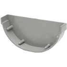
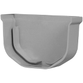

# MySense kit box
## Description
The sensors and Pi3 needs to be protected against weather influence: rain and sun heat by a box.
The box needs to allow sufficient air flow. Weather measurement box have a Stephenson screen.
As well do not block too much the wireless communications for LoRaWan, Wifi or GPS. Wood en PVC meterial block about 10% of the signal strength. ABS material blocks far more. An external antenna is not advised.

## Case example
The case used by MySense is made from Do It Yourself (Praxis) shop: PVS gutter materials: an upside down rain collector box (190 X 210 mm), for the airflow PVC gutter end pieces (4 70mm and 2 100mm end pieces) and PVC roof air exhaust (60 mm).

<figure>

 MySense case kit example

</figure>

##
 
Make small hole (max height is half of the width of the gutter end) in the front and right/left site to be covered with the gutter ends. The 100 mm gutter end go on the front.
Use PVC glue to attach the gutter ends over the holes.
Cover the air holes at the inside of the case with pieces of wire gauze. This to avoid spiders and flies to enter the box.

## Sensor back plane
In this example we used laminboard (left over from water resistant parquet in the bathroom). And glued Legi bottum plates on the front and backside to push the sensors and Pi3 as Lego bulding blocks on the back plain. Size: length 152 mm, top 120 mm, bottom 150 mm.

The bottum plate (136 mm X 185 mm) has holes (protected by pieces of wire gauze) to allow air streaming in from the bottum. The bottum plate has 4 wooden dowels to raise the kit from the floor. The sensor back plane is fixed to the bottum plate also with dowels.

The bottum plate is fixed to the case with 4 stainless steel screws. The airflow exhaist is fixated to the case also with a small screw. On the top we made a ring to allow the case to hang up.

The air holes of the airflow exhaust are a bit big and water can easily go in. So we covered the lower part with a piece of PVC tube. We shortened the tube of the exhaust.                                    

The case was painted first with a PVC primer and white paint. Use white paint to avoid as much sun heat as possible. Never the less avoid to locate the case in direct sun shine.

## Extra
The shown sensor box has a tiny window to show the little display which shows system messages. As will a water resistent led switch to signal the Pi3 for powering off (10 seconds push) or instruct the wifi to use wifi WPS (5 seconds push).

## Costs
The total costs of the case was € 25. One half day of labour.
