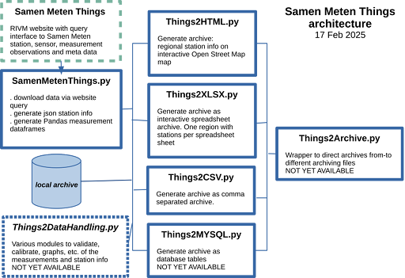

# MySense Samen Meten Tools
Last update of the README on 17th Februari 2025

## Description
Python toolset to do air quaility data analistics on measurement data from low-cost stations.
This is WORK IN PROGRESS!, inspired by the Samen Meten Tools from Zuinige Rijder (Rick).
Current (first) module is to provide a Python engine to obtain meta stations information in Python dict format and sensor observation data over a period of time in Python Pandas format for processing these website queries results by other tooling.

One is invited to check the implementation, improve functions, add archiving functions, improve performance or suggest usage functions.

The current state is the core interface to Samen Meten website API query interface, archiving measurement data in fifferent formats like json (need standardisation efforts), (gzipped) CSV format, XSLX spreadsheet format and HTML interactive map webpage with detailed regional (DIY) measurement station information. 
One is invited to add functionality to add governmental station info to the SamenMetenThgings.py module.

The goal is to add a data analyse layer: data validation, data correction, data calibration, data analisation report generator, and data visualisation (interactive heatmaps?) based on the lower level (website query, archived information and archived measure) library modules.

The scripts will use various command line options (XYZ=value) as:
- non optional argument names are either file names, regional names, station names, etc.
- **Verbosity**=n level, input/output **File**=name, **DEBUG** test data only, etc.
- Filtering options:
  - **Sensors**='pm10,pm25,pm10_kal,pm25_kal,temp,rh,no2,o3,co2,nh3' or reg.exp to focus on these sensors only.
  - **Expand**='location,address,owner,project' to xpand db table domains.
  - **Select**='' (default all) to filter station names. Use regular expression.

Use CLI **python3 ScriptName.py help** option to get more information of option use.

## Samen Meten Things architecture

## Outline of modules
### SamenMetenThings.py
The Samen Meten Things module provides a python interface to the RIVM Things API (an API) and various other website query services like Open Data Soft (CBS queries) and Open Street Map (addresses of stations).
The main routines are able to collect meta information (status information of the station, installed sensors and sensor types, period of availability, location (resolytion is ca 100 meters), address, reference stations), neighbouring stations in a region, stations in a municipality of near a GPS location) and observation data in a period of time in Pandas format.
The routines can be called as stant alone for test purposes.

The module is operating in multiprocessing modus. This gives a factor of 2-5 of speedup.
E.g. a website query can take 2-30 seconds (usualy 15 seconds). To obtain foe one sensor of a station it takes about 2 information requests, and 1 observation requests per sensor. A station has about 4-6 sensors. A municipality has about 100 stations: 100 X (2 X 5 X 6) X 15 seconds if done sequently.
The amount of records in one observation stream is not the main delay factor.

The current version is in alpha status and subjected to improvementrs and extent with more or better functionality.

The module consists about of 50% of documentation and help texts. It gives a good overview of backgrounds of the website query interfaces and use.
So read the module script!

### Things2XLSX.py
Things2XLSX will generate XLSX spreadsheet with overview of Things station names, location (GPS, address),
station properties (owner, project, gemcode, reference station codes),
and operational data of installed sensors (type, first and last timestamps, record count).
The spreadsheets will show per sheet the historical and current stations information.
Station names will be in color to denote active states (red: station not active in the period, orange: lately not active, black: active).

The script uses municipality stations routine of the SamenMetenThings class module.

### Things2HTML.py
Things2HTML will generate an interactive (Python Folium) Open Streep Map with regional low-cost station location markers.
Clicking o marker will show information of installed sensors and operational timings. The chart is interactive.
Goal is to present heatmaps of measurements as well of PM calibrated (temperature and RH) measurements.
The HTML can be used on a wegside via <iframe src=HTMLfile>.

### ThingsArchive.py
This module will await completion of alpha tests of other modules.

This script a a wrapper for XLSX, HTML map, CSV (+compressed), and JSON (+compressed).
Input can be regional names (Samen Meten Things website will be used to download data), various file formats.
The central archive will use Python Pandas dataframe format.

## Licensing
   Open Source Initiative  https://opensource.org/licenses/RPL-1.5
   Unless explicitly acquired and licensed from Licensor under another
   license, the contents of this file are subject to the Reciprocal Public
   License ("RPL") Version 1.5, or subsequent versions as allowed by the RPL,
   and You may not copy or use this file in either source code or executable
   form, except in compliance with the terms and conditions of the RPL.

   All software distributed under the RPL is provided strictly on an "AS
   IS" basis, WITHOUT WARRANTY OF ANY KIND, EITHER EXPRESS OR IMPLIED, AND
   LICENSOR HEREBY DISCLAIMS ALL SUCH WARRANTIES, INCLUDING WITHOUT
   LIMITATION, ANY WARRANTIES OF MERCHANTABILITY, FITNESS FOR A PARTICULAR
   PURPOSE, QUIET ENJOYMENT, OR NON-INFRINGEMENT. See the RPL for specific
   language governing rights and limitations under the RPL.

