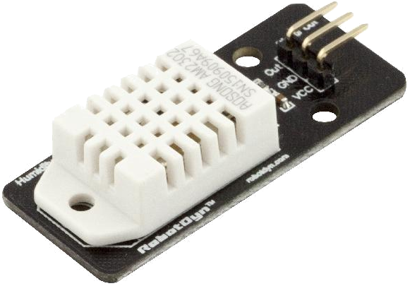

# DHT chipset plugin help for MySense
Sensor temperature, humidity
## STATUS
2017/02/08
BETA, operational
## HARDWARE
(tested) DHT22 Adafruit

Kiwi Electronics € 11.- (incl 10K resistor)
If 4K7 resistor does not work use 10K.
See: https://learn.adafruit.com/dht-humidity-sensing-on-raspberry-pi-with-gdocs-logging/wiring

## HARDWARE CONNECTION to Pi
DHT22 pinsdown, hat front up:
```
      ^
     /o\
   |-- -- |
   | ---- |
   | ---- |
   ________
    | | | |
    1 2 3 4
    V D   G
    |=|   |
    |R|   |
    | |   |
   P1 P4  P6
```
Left 3V3 pin1, pin2 data with GIO eg Pi pin #4 or #22
Pin 3 empty, pin 4 right to GRND. Resistor R 4K7 or 10K Ohm between 3V3 and data

## Reference
https://cdn-learn.adafruit.com/downloads/pdf/dht-humidity-sensing-on-raspberry-pi-with-gdocs-logging.pdf

## SENSOR TYPES supported
DHT11   blue cage needs 4K7/10K resister 5.-US$, € 7.-
DHT22   white cage more precise as DHT11, € 11.-,  needs 4K7 or 10K resister
AM2302  wired DHT22 white cage, € 17.-

## INSTALL
By default for the Pi GPIO pin control /dev/gpiomem access is only for superuser.

To avoid running as root the MySense.py user e.g. ios needs permissions:
`sudo addgroup ios gpio` You need to logout/login to activate this.
Create the file eg `/usr/local/bin/set_gio_perm.sh` with the content:
```bash
    cat >/usr/local/bin/set_gpio_perm.sh <<EOF
    #!/bin/sh
    chown root:gpio /dev/gpiomem
    chmod g+rw /dev/gpiomem
EOF
    sudo chmod +x /usr/local/bin/set_gio_perm.sh
    # add as super user to via crontab -e
    @reboot      /usr/local/bin/set_gpio_perm.sh
```

## python modules installation
From: https://learn.adafruit.com/dht-humidity-sensing-on-raspberry-pi-with-gdocs-logging/software-install-updated

For: DHT22 (more precise as DHT11), DHT11 and DHT2301 (wired DHT22)
1. You needs some libraries:
```bash
    sudo apt-get update
    sudo apt-get install build-essential python-dev python-openssl python-rpi.gpio
```
2. For SW github:
```
    git clone https://github.com/adafruit/Adafruit_Python_DHT
    cd Adafruit_Python_DHT
    sudo python setup.py install
```
3. simple hardware  test:
```bash
    cd examples
    # sudo ./AdafruitDHT.py sensor_type pin_nr e.g. DHT22 on pin 4:
    sudo ./AdafruitDHT.py 22 4
```
DHT is real time dependent so you may miss a reading. Try again.
You should see something like:
`Temp=23.0*  Humidity=26.4%`

## MySense
Edit the `MySense.conf` file and add the section dht and complete the options e.g.:
```
    [dht]
    input = true
    type  = DHT22
    pin   = 4
    # optional calibration factors for temp and hr (example here is order 1: a0+a1.x))
    calibrations = [[-0.3,1],[3.9,1]]
```
To evaluate run this as user `ios`:  `./MySense.py -i dht -o console -l debug`

Make sure there is more as 2 seconds delay between two samples.
