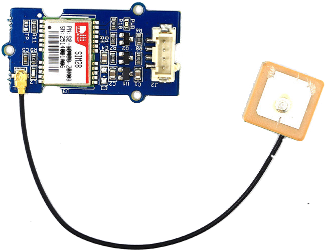

# MySense GPS input plugin
## STATUS
2017/02/21
Operational: used with the GPS daemon

## MySense install
Install

 the dependent modules with `INSTAL.sh GPS`
The `gpsd` daemon will find the tty, but you can provide in `/etc/default/gpsd` the `DEVICES=/dev/ttyUSB0` for gps via the USB connection. Use for OPTIONS `-G`.

Test the GPS function (see paragraph on hardware tests.

## Hardware kits
* Grove GPS
If you use a GrovePi shield on a Pi:
Use with GrovePi shield the Grove-GPS (€ 36.-) to hook it up to the RASP-serial socket (/dev/ttyAMA0) on the shield.

* Adafruit Ultimate GPS
If you prefer to use serial eg USB TTL cable:
Adafruit Ultimate Pi GPSHAT minikit € 50.- (more dynamic board)
This needs soldering on the Ultimate board.
You can use TTL serial USB cable eg CP2102 € 12.-,
so you have  less soldering (use 4 pin connectors to 3V3!) and can use it on every computer. Make sure you use the right voltage leads: V3.3.
Optional:
CR1220 battery (€ 2.-) if you have a bad power and need to keep the real time clock.
External antenna 3-5V 28 DB to work in house € 15.- Order this with a pig-tail SMA uFL/u RF cable € 5.- (https://www.kiwi-electronics.nl/SMA-naar-UFL-kabel?search=SMA)

Ultimate GPS module has a built in patch antenna - -165 dBm sensitivity. If you want to place your GPS module in a box, it might not be possible to have the antenna pointing up, or it might be in a metal shield, or you may need more sensitivity. In that case use external antenna.
Active antennas draw current, so they do provide more gain but at a power cost: 10-20mA.
Version 3 has the capablity to save the location log data internally. See the Adafruit documentation for this:
* https://cdn-learn.adafruit.com/downloads/pdf/adafruit-ultimate-gps.pdf

Alternative: HAB Supplies GPS for Pi (no need for pig-tail) + antenna (CR2032 battery)
Costs 36 UK L. It is a hat for Pi, no soldering. (Attaches to ttyAMA0 or TTYS0)

Advised is to use USB serial connection. Avoid with USB that the serial device path is surviving a reboot. E.g. use udev rules to accomplish this. If one uses the TTL pins of the Pi make sure no login is started on the pins and Bluetooth is separated. See also:
* http://www.catb.org/gpsd/installation.html
One frustration is that the TTL pins use GPIO and may cause read errors on some USB serial connector. In `/etc/default/gpsd` set USBAUTO to false and add option '-b' (read only use of serial by gpsd). If it does not help one may disable the gps module in MySense.conf or if needed disbale `gpsd` daemon in such cases.

## Hardware configuration
If attached to UART (GPIO) pins of the PI the /dev/ttyAMA0 (Pi 1/2) or /dev/ttyS0 (Pi 3) should be disabled to run login terminal:
* From: https://github.com/mcauser/Raspberry-Pi-ITead-Studio-GPS-NEO-6M#disable-kernel-logging
Use raspi-config to turn shell/kernel messages via serial off: Advanced/Serial menu tabs. 
* On Pi3 with Jessie and later:
use sudo raspi-config to disable login (getty: disable) and kernel use of serial line (enable).
Reboot and ls /dev/ will show you serial0 and serial 1 linked to `ttyS0` and `ttyAMA0`.
Pi3: `ttyAMA0` is used for bluetooth so use ttyS0 for your GPS configuration.

On Jessie OS version, prevent speed changes on serial port and add next line to `/boot/config.txt`
```
enable_uart=1
```
Inother words: for Pi3:
0. The most simple route we used was to use the `sudo raspi-config` script and use the menu `interfaces` -> serial -> disable console and enable serial hardware, and reboot. You should be able to `ls /dev/ttyS0`. If not try step step 1 etc. If so install `apt install gpsd`, set in `/etc/defaults/gpsd` DEVICES to `DEVICES=/dev/ttyS0`, enable `START=true`, connect GPS module (3V3!!, Gnd, GPS Tx->Rx Pi pin 10, GPS Rx -> Tx Pi pin 8) and start the deamon `sudo systemctl restart gpsd`. Install `gpsd-clients` and see if `gpspipe -w -n 15` shows gps data.

1. make sure UART is not used by kernel:
Check first if at boot /dev/ttyAMA0 or ttyUSB0 is used somehow:
    `cat /proc/cmdline`
Look for _tty,115200_ references.
If so: change in `/boot/config.txt` change the line: `enable_uart=0 into enable_uart=1`
add the lines:
```
    dtoverlay=pi3-miniuart-bt
    force_turbo=1
```
change `/boot/cmdline.txt` remove *ttyAMA0* references in the line like:
```
dwc_otg.lpm_enable=0 console=ttyAMA0,115200 kgdboc=ttyAMA0,115200 root=/dev/mmcblk0p2 rootfstype=ext4 elevator=deadline fsck.repair=yes rootwait quiet splash plymouth.ignore-serial-consoles
```
and change the console=... and kgdbox=... parts into `console=tty1`
console defines boot messages to go to, kgdbboc defines kernel debug messages to go to.

2. disable a login on the ttyS0 or ttyAMA0:
```shell
    sudo systemctl stop serial-getty@ttyS0.service
    sudo systemctl disable serial-getty@ttyS0.service
```

For *Pi 3*:
If bluetooth is not needed, disable the use of _ttyAMA0_ of the high speed AMA0
See also: `/boot/overlays/README`
Add to `/boot/config.txt` the line: `dtoverlay=pi3-miniuart-bt`
This will swap the serial0 and serial1 links after a reboot.
From the jessie OS the kernel will have `/dev/serial0` and `/dev/serial1` as alias (symbolic link) to the two available serial ports. Advised is to use the alias in the configuration. `/dev/ttyS0` might show errors on higher baud rates. In this case lower the CPU speed of the Pi a bit. See *Tips and Tricks* book for more info on this.

You can use now /dev/ttyAMA0 for the GPS serial device.
Or
    Change `/lib/systemd/system/hciuart.service` (bluetooth):
    change line: *After=dev-serial1.device*
    into: `After=dev-ttys0.device`
    change line: *ExecStart=/usr/bin/hciattach /dev/serial1 bcm43xx 921600 noflow -*
    into: `ExecStart=/usr/lib/hciattach /dev/ttys0 bcm43xx 460800 noflow -`

Power off/on and reboot (and wait at least 15 minutes to get a lock with satillites.

## Hardware test:
On Debian you should use the path as provided by `ls -l /dev/serial/by-id`.

Use from github `GrovePi/Software/Python/grove_gps` the `grove_gps_hardware_test.py` to see if you get data and `GroveGPS.py` to get human readable data. If not make sure you use the right serial */dev/ttyS0* (and change this in the Grove python script) or the standard */dev/ttyAMA0*. Make sure you are in the group dialout (use the command groups).

See also [ultimate python setup](https://learn.adafruit.com/adafruit-ultimate-gps-hat-for-raspberry-pi/pi-setup)
or use (easier) an USB TTY uart cable attached to VCC/GRND/RX/TX of Adafruit hat. Detect with `lsusb` the manufacturer ID eg Future Technology Devices International (needed for the IoS gps plugin)

Note that it can take 20 minutes to get a good lock with the satellites.

## SOFTWARE:
NMEA serial or preferably use the GPSD daemon

If you use the *gpsd* daemon for the Debian config default see `/etc/default/gpsd` to define the device. See via `ls -l /dev/serial/by-id` for the USB serial and use that iso `/dev/ttyUSBn` as device name. This as the USB number might change on a reboot and the path from *by-id* will be more stable.

### INSTALLING NMEA lib
```shell
    sudo pip install pynmea2
    git clone git://github.com/modmypi/GPS
    cd GPS; python gps.py
```
or use the code:
```python
    import serial
    import pynmea2

    def parseGPS(str):
        if str.find('GGA') > 0:
            msg = pynmea2.parse(str)
            print "Timestamp: %s -- Lat: %s %s -- Lon: %s %s -- Altitude: %s %s" % (msg.timestamp,msg.lat,msg.lat_dir,msg.lon,msg.lon_dir,msg.altitude,msg.altitude_units)

    serialPort = serial.Serial("/dev/ttyAMA0", 9600, timeout=0.5)

    while True:
        str = serialPort.readline()
        parseGPS(str)
```

### INSTALLING GPSD
```shell
    sudo apt-get install gpsd python-gps
```
Make sure `/etc/default/.gpsd` enables start of daemon, set USBAUTO to "false" and use as OPTIONS "-G -b" (read only).

#### RUNNING GPSD
On PI *Jessie* and running manual test (below) command stop/disable gpsd.socket with the command systemdctl stop gpsd.socket followed by disable.
Start the deamon: `sudo gpsd /dev/ttyS0 -F /var/run/gpsd.sock`

##### TESTS:
Run some manual tests to see if GPS is working:
_XXX=AMA0_ or _S0_ or USB serial like _USB1_

One may need to install telnet (`apt install telnet`) first.

Stop the gpsd daemon: `sudo service gpsd stop`
startup gpsd: `sudo gpsd -n -N -D 5 /dev/ttyXXX`
and in another window, so you can see what is going on:
```shell
    telnet localhost 2947
    telnet> ?WATCH={"enable": true, "json": true}<return>
```
(Not on the Pi) install e.g. a gps-client and try xgsp or cgps -s (less detailed output)
    run: `sudo gpsd /dev/ttyS0 -F /var/run/gpsd.sock`

Another test to see if MySense is able to get gps data is to use the command `python MyGPS.py 1`. This should provide you with the current gps location.

##### ENABLE GSPD
Add to `/etc/default/gpsd` the line `DEVICES=/dev/ttyXXX` (XXX is AMA0, S0 or USB1)
and run: `sudo service gpsd restart`
On success enable it: `systemctl enable gpsd`

### GSPD and USB serial lines WARNING
We discovered that the GPSD daemon disrupted some USB serial interfaces e.g. the USB serial interfaces to Spec (gas) adapters.
Initiating the GPS daemon with the `-b` flag and setting in `/etc/default/gpsd` automatic USB discovery on false, did solve the problem. If not disable the daemon.
The serial TTL used by gpsd is using GPIO with a high clock speed. This may disrupt USB serial data reads.

To-Do: try to read gps data direct from the USB serial interface with fixed path name?

### USB TTL serial cable
Use the command `lsusb` to see it the USB serial is detected by the kernel.
Try to set the tty 9600 8N1:
```shell
    stty -F /dev/ttyXXX raw 9600 cs8 clocal -cstopb
```
and simply: `cat /dev/ttyXXX` see some raw output
of GPS “NMEA sentence” from the GPS module.
If there is no GPS _lock_ you see lots of comma's.

You may be unlucky with the serial USB dongle: it is not recognized:
* Adding the following entries to /lib/udev/rules.d/69-libmtp.rules did the trick
```
ATTR{idVendor}=="05c6", ATTR{idProduct}=="6764", SYMLINK+="libmtp-%k", MODE="660", GROUP="audio", ENV{ID_MTP_DEVICE}="1", ENV{ID_MEDIA_PLAYER}="1", TAG+="uaccess"
ATTR{idVendor}=="05c6", ATTR{idProduct}=="6765", SYMLINK+="libmtp-%k", MODE="660", GROUP="audio", ENV{ID_MTP_DEVICE}="1", ENV{ID_MEDIA_PLAYER}="1", TAG+="uaccess"
```

## MySense TEST
See the script MyGPS.py. You can run this as `python MyGPS.py`.
Test first without multi threading (all data collection in sync): sync -> True
And set debug -> True and run: python (or pdb) MyGPS.py

Displayed are collected coordinates from gpsd daemon (make sure it is started and running).
In second fase set sync -> False and try again.
