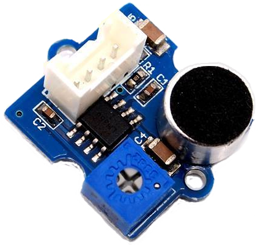

# Loudness Grove sensor
Operational: 2017-02-21

## description
You need to have a Raspberry Pi (or Arduino) with a GrovePi+ shield (Kiwi Electronics € 35.-) from Dexter Industries.
Kiwi Electronics Grove Loudness sensor € 8.-

Advise: use for GrovePi+ sensors the Lego sockets and a Lego groundplate.

You need the grovepi module eg via https://github.com/DexterInd/GrovePi
or use the `INSTALL.sh grovepi` script.

## hardware
Attach the sensor

to an analogue port of the GrovePi+, e.g. A0.
The Grove Pi+ has 3 analog socktes/ports: board up, pin side on top left: analog ports are on the left side, top is number 0.

## test hardware
Use the python script: git/GrovePi/Software/Python/grove_loudness_sensor.py
It should display every second a line with loudness value (uncalibrated).

## use with MySense
First test with (see the script) with sync option set to True and debug to True
On failure use pdb (python debugger) to see stepwise for the failure.
On success set option sync to False in the script.

## MySense configuration
Set in MySense config file the sector [dbgrove] and e.g. port: A0
With interval and bufsize you are able to tune the frequency of polled values.

## Grove specifications
Grove Loudness specifications (from Grove: http://www.exp-tech.de/en/seeed-studio-grove-loudness-sensor)
```
Item              Min Typical Max Unit 
Voltage           3.5 5.0     10  VDC 
Working Frequency 50  -   20,000  HZ 
Sensitivity      -48  -       66  dB 
Signal-to-noise Ratio >58         dB 
Output Signal      0  -     1023  /
```
## calibration
The current calibration is set as linear between sensitivity and output signal, which is wrong.

* conversion TO dB, dBA, or dBV
See article: http://www.animations.physics.unsw.edu.au/jw/dB.htm
Grove Loudness measures voltage 0-1023: 20log((3.5+6.5*signal/1024)/3.5) = dB?
