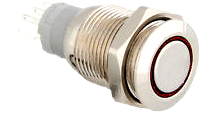

# Grove LED feedback and button
### Status
2017/02/27
Operational 2017/3/17

# How To poweroff Raspberry Pi with button
* Use `INSTALL.sh BUTTON` to install the script. This will also install the deamon poweroff. This deamon will watch the button to power off the Pi.

The script

uses Grove led and Grove button modules and the GrovePi shield (or hat). Connect both modules e.g. with connector D5 (button) and D6 (led) of the GrovePi shield.
Suggest to use a robust led/button from Adafruit and connect the led/button to the both Grove modules.
Suggest as well to combine both D5 and D6 on one Grove connector: D5 to white wire and D6 to the yellow wire. So one can use one connector.

The script MyLed.py can be used to wait for a pushed button, or psh the led on or off or blink is in a seuence defined on the command line.

The script is used to notify internet connectivity and access point association (blinking). The `INSTALL.sh BUTTON` will install `/usr/local/etc/poweroff` toi watch button pressures for powering down the Pi. In this case press and hold the button pressed.

### hardware
* Grove modules led € 2.25 (Kiwi or SOS Solutions)
* Grove button € 2.50 (Kiwi or SOS Solutions)
* Rugged metal pushbutton with led ring € 8.- (SOS Solutions)

Use of button and resistors:
```
    V ---/ _---------|---<R 1K Ohm> ----Gnd
    D6 ---< R 100 Ohm>---|
```
Use of led and resistors:
```
    D5 ---< R 330 Ohm>--<+led-> ---- Gnd
```
Make sure the led cathode leg is connected to Gnd part. Cathode leg: the short leg, inside the led the one which "points to" the positive (anode) leg.
