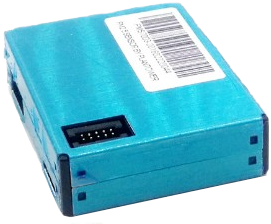

# dust sensor Plantower PMS5003 and PMS7003
## Status
In alpha since 20th of July 2017

## Description
The dust sensor

 counts particles 0.3,0.5, 1.0, 2.5, 5.0, and 10 um (mu) per 0.1 liter (dm3),  and outputs ug/m3 for PM1, PM2.5 and PM10.
There are many Plantower dust sensors from 1003 upto 7003. All vary in size from big to tiny. The interface specifications do not differ much however. The 5003 and 7003 outputs 32 bytes data telegrams.
The 5003 and 7003 are supported by MySense.

There are 2 interface types of the PMS module: I2C and TTL (USB) serial. Tested in MySense is only the serial version.

The Plantower dust sensor is simple to connect via a TTL USB. The serial output is 9600 baud (1 stop bit), and outputs are binary data telegrams (32 bits/ 16 bit data integers).

The sensor can operate in active (working) and passive mode. The module can be put to sleep e.g. via 3V3 (use it with 10K resister) *set* pin.
The sensor has a build in fan (5 VCC). On power on the sensor will be in active state (fan ON). There is a reset pin (3V3 high with 10K resistor).

The PMS7003 is a late design (2016), is smaller, and uses less power as the PMS5003. The manual pages of different modules do not differ much. The MySense test has been done with a PMS7003.
The sensor is tiny, AQICN reports: calculates temperature and humidity influence (Bart) and seems very reliable.
Airflow mechanics are very good in respect to Dylos.

It is hard to find an english version of the specifications and programming interface.

Cost price is about € 22 (Ali Express).

## References
* http://www.aqmd.gov/docs/default-source/aq-spec/resources-page/plantower-pms5003-manual_v2-3.pdf?sfvrsn=2 english version of specification of PMS7003 from Plantower
* http://aqicn.org/sensor/pms5003-7003/ AQICN test of 2 (pms5003/pms7003) X 3 sensors, compared with BAM1020 and comments on the sensor.
* http://www.rigacci.org/wiki/doku.php/doc/appunti/hardware/raspberrypi_air Plantower PMS5003 application with Pi

## Hardware
Use the 8 wire connector provided with the sensor to connect it with a USB serial TTL cable. The connection is as follows:
```
PMS7003
    sensor module  10 pin connector    USB TTL eg Prolific PL2303TA
|----------------| connector comes with sensor module
||----|          | (pin 8) N/C red ------   not used
||1  2|          | (pin 7) N/C black ----   not used
||.  .|          | (pin 6) reset yellow - left unused (10K Ohm -> 3V3 pin?)
||9 10|          | (pin 5) Tx  green ----xxx-- white Rx -----------\ USB
||----|          | (pin 4) Rx  blew -----xxx-- green Tx -----------\ USB
|                | (pin 3) set white ---- left unused (10K Ohm -> 3V3 pin?)
|                | (pin 2) Gnd orange ---xxx-- black Gnd-----------/ USB
|                | (pin 1) 5V  purple ---xxx-- red   5V -----------/ USB
|----------------|
```
Or connect Tx(green),Rx(blew),Gnd(orange),5V(purple) to respectively Rx(yellow),Tx(white),5V(red), Gnd(black) standard connector of GrovePi+ serial (/dev/ttyAMA0 and make sure it is not used by Jessie; see how to of Grove GPS for details).

## Dependences
The module depends on serial and struct standard Python library module.

## Usage
The module MyPMS7003.py will drive the Plantower PMS5003 or PMS7003 sensor. Test it first as standalone python script. Use the Conf settings to increase the debug level and turn in first instrance the multithreading off (`Conf["sync"] = True`).

The sensor will measure particles in ug/m3. Change the option units (`Conf["units"]`) from ug/m3 to pcs/qf. As well the senor will do counts per 0.1 liter. The software will convert it to pcs/0.01qf unless the `Conf["units"]` will be set to pcs/0.1dm3.

By default only PM1, PM2.5 and PM10 (calibration set to [0,1]) will be in the output. Define fields option (Conf["fields"]) as e.g. pm03_cnt, pm25_cnt, etc for particle count values, or pm1_atm, pm25_atm, pm10_atm (default in ug/m3) for concentration in generic atmospheric conditions values:
calculation of temperature and humidity effect(?).

The configuration `interval` will define the measurement (an average of the sampled data) value per period of *interval* seconds (default 120 seconds).
Every second in a *sample* (seconds, default 60 seconds) period from the sensor module the values will be read.
The configuration `sample` defines the the *sample* period. Other values sent by the sensor are discarded.

For interval timings larger as sample time plus 60 seconds the sensor module will be put to passive standby (fan off) mode. MySense will wait 30 seconds to collect the first read (passive normal mode) in order to allow stabilizing the airflow. During sampling data values MySense will wait 10 seconds. The average value during the sample time is provided for each interval period.

## Comments
It is unclear which algorithm and calculation coefficients are used by the manufacturer to convert particles count values to mass (ug/m3).

It is unclear what the sample timing is for each data value, eg the Dylos sample time is 59 seconds.

Indoor tests so far give a lot of zero values for particles larger as 5 mu. Which is not uncommon (Shiney PPD42NS provides similar values in this case).

## To Do ?
Either via the *set* pin or via the command interface to the sensor the fan and so readings can be put to sleep mode. From sleep mode to active mode one has to discard readings for 30 seconds. Limiting the fan powered on will increase the module life time.

## MySense serial protocol implementation
From the manual V2.3:
* CMD `0xe1 X 00H checksum` put sensor in passive mode.
* CMD `0xe4 X 00H checksum` standby mode (fan OFF?).
* CMD `0xe4 X 01H checksum` normal mode (fan ON?), and wait 30 seconds.
* CMD `0xe2 X X   checksum` read 32 bytes
* CMD `0xe4 X 00H checksum` standby mode (fan OFF?).
*
* CMD `0xe1 X 01H checksum` put sensor in active mode.

Email exchange with Plantower.com defines passive serial protocol as:
```
42 4D E1 00 00 01 70 - passive mode  answer: 42 4D 00 04 E1 00 01 74 
42 4D E1 00 01 01 71 - active mode   answer: 42 4D 00 04 E1 01 01 75
42 4D E2 00 00 01 71 - passive mode read instruction, answer: one data telegram
42 4D E4 00 00 01 73 - standby mode  answer: 42 4D 00 04 E4 00 01 77 
42 4D E4 00 01 01 74 - standby wakeup, no answer
```
PMS7003 may send (10) data telegrams with zero particle count readings.

## Calibration
Correlation test from one week of measurements, see e.g. ../statistics/CorrelationReportSummary_2017-08.pdf show a very positive correlation results with the Nova SDS011 and Dylos DC1100 measurements. AQICN did correlation tests with the BAM1020 and states better results as with the Nova and Dylos sensor (see http://aqicn.org/sensor/pms5003-7003/).

## Lifetime
Life time is shortened due to the fan (as with the Nova SDS011) and dust. AQICN reports a better design of the air flow for the PMS5003/7003 sensor as with the Dylos sensor. However the Dylos and Nova sensors have a fan which is easy to remove and to clean.
