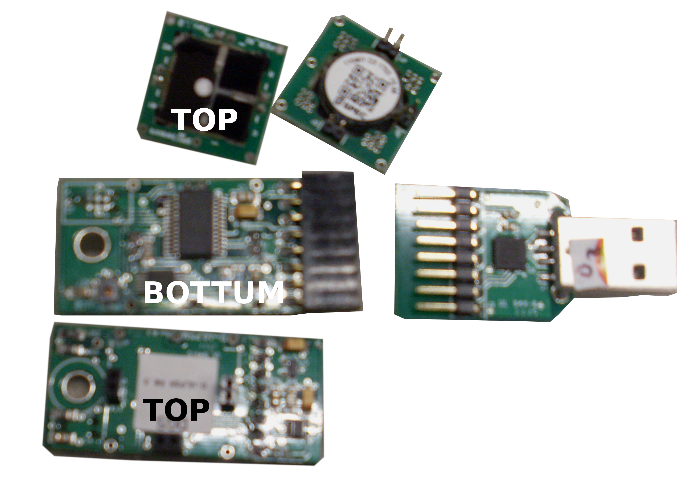

# gas sensors from Spec
## Status
In beta test since 29th of May 2018

## Description
The gas sensors from Spec

is simple to connect via a TTL USB. The serial output is 9600 baud, and input (commands)/ output are in ascii. Default on poweron the Spec gas sensor will be in standby mode. Any input character will put the module in active mode smapling internally PPB values and averaging (dflt disabled) them. The manual dictates: By sending a 'c' the module will send regularly a line of values to the host. By sending a '\r' character the module will respond with a measurement line. 
Note: we tried to read the eeprom but did not succeed.
The module needs one hour to stabalize.

A module has three parts: the Spec sensor (O3, NO2, or CO), the TTL interface with the eeprom, and the USB TTL adapter. All input is read in parrallel (threaded input).

Cost pricing varies between € 50 and higher. Make sure one uses an serial USB converter to interface to the 3V3 based TTL serial interface of the module. MySense used `Cygnal Integrated Products, Inc. CP210x UART Bridge / myAVR mySmartUSB light`. See the config example for the appetrn to recognize which USB has the gas adapter.

## Configuration
### hardware
As there maybe more as one Spec gas sensor connected to the Pi MySense will need a way to get all the serial USB adapters. Plug in the USB adapter of a Spec sensor. Use `lsusb` command to get an overview before and after the USB adapter is connected. Here the difference as example:
```
...
Bus 001 Device 009: ID 10c4:ea60 Cygnal Integrated Products, Inc. CP210x UART Bridge / myAVR mySmartUSB light
Bus 001 Device 008: ID 10c4:ea60 Cygnal Integrated Products, Inc. CP210x UART Bridge / myAVR mySmartUSB light
...
```
Denote the idProduct (e.g. "ea60") and idVendor (e.g. "10c4"). And create the following udev rule in in the file `/etc/udev/rules.d/50-Sensor.rules`:
```
ACTION=="add", KERNEL=="ttyUSB*", ATTRS{idVendor}=="10c4", ATTRS{idProduct}=="ea60", MODE="0660", GROUP="dialout", SYMLINK+="SPEC%n"
```
After a reboot do a test:
```shell
ls -l /dev/SPEC*
```
It should show something like:
```
lrwxrwxrwx 1 root root 7 May  9 16:31 /dev/SPEC1 -> ttyUSB1
lrwxrwxrwx 1 root root 7 May  9 16:31 /dev/SPEC2 -> ttyUSB2
lrwxrwxrwx 1 root root 7 May  9 16:31 /dev/SPEC3 -> ttyUSB3
```

You need to know the S/N number of the gassensor to discriminate between the gasses.
Use the followin small python script for this and to check if the sensor is working:
```python
import serial
from time import sleep
try:
  serial = serial.Serial("/dev/SPEC1", baudrate=9600,
            timeout=5,writeTimeout=1,
            stopbits=serial.STOPBITS_ONE, parity=serial.PARITY_NONE,
            bytesize=serial.EIGHTBITS)
  serial.write('\r')
  print("Spec S/N:",serial.readline().split(' ')[0])
except:
  print('Spec USB not founa or write/read error')
```

### MySense configuration
Make sure you define the lists `fields`, `unit` and `serials` of Conf configurations.
E.g. `Conf['fields'][0] = 'no2'`, `Conf['units'][0] = 'ppb'` and `Conf['serials'][0] = '0123456789' is the serial number as in the output of the USB sensor.

MySense `MySPEC.py` will look for the available gas sensors in a similar way and will detect which gas sensor is attached via a look at the eeprom readout or serial number as is configured in MySense.conf.

* `type` dflt: Spec ULPSM, type of sensor module
* `usbid` dfld: SPEC, pattern as identified from `ls -l /dev/` for interface
* `raw` output also raw measurement values (dflt False)
* 'is_stable` amount of secs (dflt 0) to wait begore measurements are shown (1 hour?)
* `omits` list of field names to omit in output, dflt: nh3,temp,rh
* `prefix` (boolean, dflt False) prepend field names with 3 char of type, e.g. spe_temp
* `interval` interval of measurement sample dflt 60 secs.
* `debug` be more versatile e.g. print output from serial interface
* `bufsize` size of internal array of measurements: every read (read period) is sliding average of sample values 
* `sync` boolean: do not use input threading, dflt: False

## PPB to ug/m3 conversion
If the unit is defined as ug/m3 the Spec PPB value of the measurement will be converted from PPB to ug/m3.
In the conversion MySense will use the temperature value of the Spec sensor.

## References
* http://www.spec-sensors.com/wp-content/uploads/2017/01/DG-SDK-968-045_9-6-17.pdf specification of the API
While testing the Spec input module no commands were honored. On any character sent the sensor reacted by sending one measurement.

## Correlation test
Output has been tested against reference sensors at GGD Amsterdam early 2017. They look good but there is a need to retest after an outdoor period.

The Spec gas module will do the conversion from mVolt and ref mVolt towards the ppb values. We did not succeed to "zero" the Spec module in order to calibrate the ref mVolt. The MySense software will not show negative ppb values (values are forwarded as None values). This might cause that ppb values less as zero may result in false values. To compensate this one is suggested to use the calibration support.

Denote that the Spec module needs ca 60 minutes to establish a more reliable output of measurements.

## ISSUES
There is an issue on serial line data corruption with the Cygnal Intergrated Producs USB UART. The issue diappears when the GPS is disabled in MySense. GPS data is read via a GPS deamon. Not sure what the cause is.

Make sure the Pi power adapter is able to provide more a 1.5 A! A warning signal maybe the power icon on the startup screen of the Pi.

## Dependences

## Usage
MySense tries to read the eeprom to identify wich serial interface with the USB adapter from Cygnal Intergrated measures which gas. On failure one measurement is read to lookup the gas ID via the serial number (on the back of the gas sensor part). Only the configured gas fields are added for measurements.

Serial input is read (9600 baud, 8-bit, no parity, 1 stop bit)  on interval basis with the request for input command. The serial line output of the TTL is as follows (all integers):
```
SerialNr,PPB gas, temperature oC, rel. humidity %,
    SDAraw, Traw, RHraw, days, hours, minutes, seconds \r\n
```
For every USB gas sensor a thread is initiated measuring at interval periods PPB, temp and RH (average) values and averaging them. `BUFSIZE` will limit the max of measurements by the sensor.

MySense will recognize all USB interface and join this withe gas ID automatically. Make sure to use a unique serial TTL USB converter.

Output to MySense main part example:
```json
    { 'time': seconds, 'o3': ppb, 'no2': ppb, 'co': ppb }
```

## MySense module Configuration
* `input` boolean will define to enable the sensors read.
* `type` will identify the Spec gas sensor ID dflt Spec ULPSM
* `usbid` will identfy the USB serial adapter, dflt Silicon_Labs_CP210
* calibrations, fiels, units is an array to identify calibration factors, names, and units of measuements.
* `raw` will enable raw values to output via MySense
* `is_stable` is amount of seconds to wait for measurments after power on, dflt one hour.
* `omits` is gn array with names of gasses to omit
* `data` list of names to pick up from sensor modules, dflt ppb, temp, rh (None is disable this field)
* `interval` interval to read measurments by the thread, dflt 60 (one minute)
* `bufsize` is size to take average of measurments by the thread, dflt 30
* `sync` enable input threading (gas seanor readout is done in parallel, dflt enabled.
